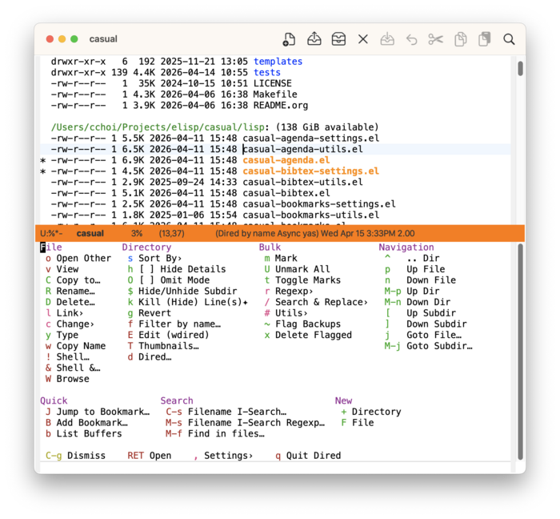
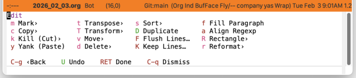
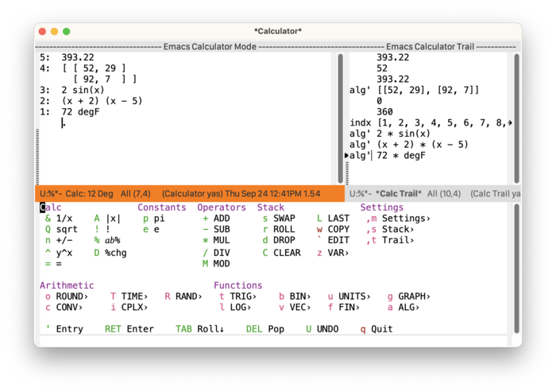

[](https://melpa.org/#/casual) [](https://stable.melpa.org/#/casual) [](https://elpa.nongnu.org/nongnu/casual.html)


# Casual

Casual is a project to re-imagine the primary user interface for Emacs using keyboard-driven menus.

Emacs has many commands that are easy to forget if not used frequently. Menus are a user interface (UI) affordance that offers discoverability and recognition. While menus are commonly associated with mouse-driven UI, the inclusion of [Transient](https://github.com/magit/transient) in Emacs core allows for building menus that are keyboard-driven instead. This appeals to users that prefer keyboard-driven workflows.

Casual organizes itself primarily around the different built-in modes Emacs provides. For each mode Casual supports, there is a bespoke designed library of Transient menus for that mode’s command set.

Casual has no aims to be a mutually exclusive user interface. All existing user interfaces to commands (keybinding, mini-buffer prompt, mouse menus) are still available to the user.

To learn more about the motivations and design considerations for Casual as well as seeing it at work, please watch the presentation [“Re-imagining the Emacs User Experience with Casual Suite”](https://emacsconf.org/2024/talks/casual/) from EmacsConf 2024.

Please refer to the [Casual User Guide](https://kickingvegas.github.io/casual) for detailed information about it. This user guide is available both in Emacs Info and HTML formats.

Shown below are some screenshots of menus offered by Casual. Many [Emacs built-in modes](https://kickingvegas.github.io/casual/Casual-Modes.html) are supported by Casual.

*Screenshot of Dired main menu.*



*Screenshot of EditKit edit menu.*



*Screenshot of Calc main menu.*




# Requirements

Casual requires the following software to be installed as baseline:

-   [GNU Emacs](https://www.gnu.org/savannah-checkouts/gnu/emacs/emacs.html) 30.1+
-   [Transient](https://github.com/magit/transient) 0.9+

Versions of GNU Emacs 30.1 or greater will satisfy the above requirements with its built-in version of Transient.

Certain Casual modules require more installed software:

-   Casual Dired: [GNU Core Utilities](https://www.gnu.org/software/coreutils/) 8.32+
-   Casual Image: [ImageMagick](https://imagemagick.org) 6+
-   Casual CSV: [csv-mode](https://elpa.gnu.org/packages/csv-mode.html) 1.27+ (installed as a dependency)

Casual has been verified with the following configuration:

-   GNU Emacs 31.1 (macOS 15.7, Ubuntu Linux 22.04.5 LTS)


# Install

Casual versions 3.0 or greater offer a simplified installation with the command `casual-init`. Run this via `extended-execute-command` (`M-x`) or add this to your Emacs initialization file.

```elisp
(require 'casual)
(casual-init)
```

By default `casual-init` will setup keybindings for all modules supported by Casual. Configure the customizable hook variable `casual-init-hook` to control which modules to enable.

```
M-x customize-variable casual-init-hook
```

Users can choose any or all of the user interfaces made available by Casual at their pleasure.

To lower cognitive load, Casual uses the convention of re-using the same keybinding to invoke a mode-specific main menu. For this purpose, Casual uses two customizable variables to specify what keybinding to bind to a Transient menu for a mode.

-   `casual-keybinding-primary` (`C-o`) - used for a main menu
-   `casual-keybinding-secondary` (`M-m`) - used for an auxiliary menu

Modify these variables to preference.

Casual makes [opinionated design decisions](https://kickingvegas.github.io/casual/Motivations.html) on menu keybindings that do not necessarily align with existing default bindings of a mode. Each hook function in `casual-init-hook` honors a module specific variable to make additional keybindings that reconcile Transient menu bindings with that of a specific mode map. These variables are of the form `casual-<module>-add-extra-keybindings` and by default are set to `t`. Users wishing to disable them can do so via `customize-variable`.

Note that `casual-init` will only work if Casual is installed via `package-install`.

Users of Casual version 2.x do *not* have to change their existing setup. That said, migrating to `casual-init` offers significant convenience by requiring less configuration.

For more detail on installation of different modules refer to the [Casual User Guide](https://kickingvegas.github.io/casual/Install.html).


# Development

For users who wish to help contribute to Casual or personally customize it for their own usage, please read the [developer documentation](docs/developer.md).


# Sponsorship

It costs money to make, enhance, and maintain Casual as ideologically free software. If you enjoy using Casual, please buy me a coffee to help support its development and maintenance.

[](https://www.buymeacoffee.com/kickingvegas)


# See Also

While the package `casual` focuses on user interfaces for built-in Emacs modes, there are other third party packages which receive the “Casual” treatment. Two such packages are:

-   [Casual Avy](https://github.com/kickingvegas/casual-avy) (Elisp package: `casual-avy`)
    -   An interface for the highly capable Avy navigation package.
-   [Casual Symbol Overlay](https://github.com/kickingvegas/casual-symbol-overlay) (Elisp package: `casual-symbol-overlay`)
    -   An interface for the Symbol Overlay package.

Users interested in getting all current and future Casual interfaces for both built-in and third party packages should install [Casual Suite](https://github.com/kickingvegas/casual-suite), which includes all of the above packages including `casual`.


# Acknowledgments

A heartfelt thanks to all the contributors to [Transient](https://github.com/magit/transient), [Magit](https://magit.vc), [Org Mode](https://orgmode.org), and [Emacs](https://www.gnu.org/software/emacs/). This package would not be possible without your efforts.

<p align='center'>© 2024-2026 Charles Y. Choi</p>
