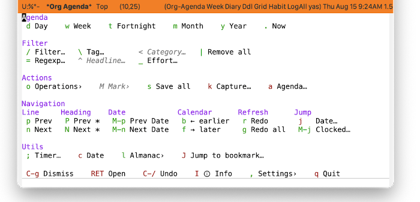
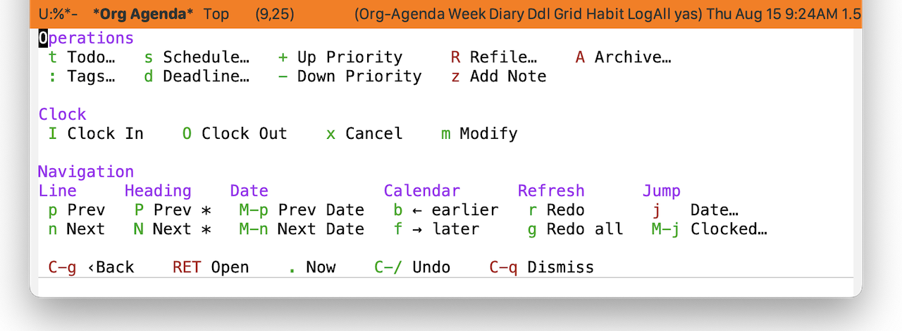
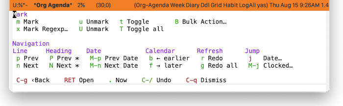
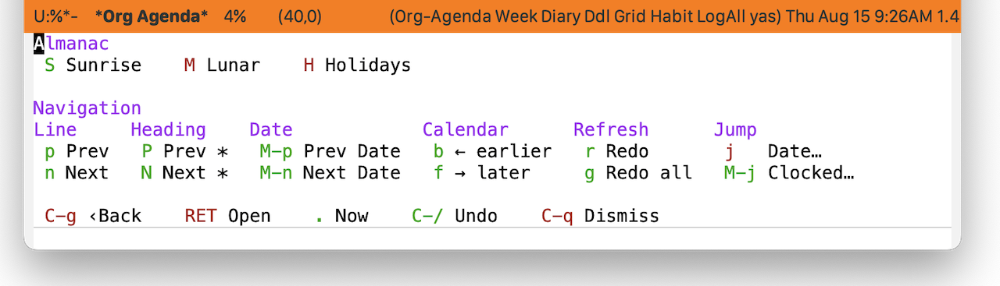
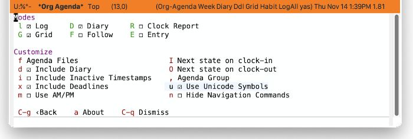
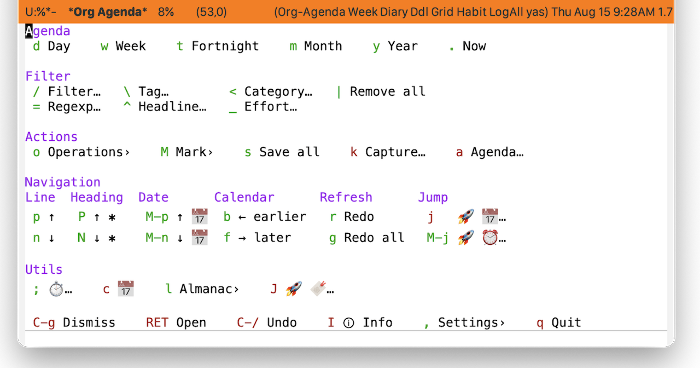

* Agenda
#+CINDEX: Agenda 
#+CINDEX: Org Agenda
#+VINDEX: casual-agenda
Casual Agenda (library: ~casual-agenda~) is a user interface for Org Agenda ([[info:org#Agenda Views]]), a feature of Emacs Org Mode ([[info:org#Top]]) to help plan your day. Its top-level library is ~casual-agenda~.

** Agenda Install
:PROPERTIES:
:CUSTOM_ID: agenda-install
:END:
#+CINDEX: Agenda Install

#+TEXINFO: @subsubheading Simplified Install
#+VINDEX: casual-agenda-init

If Casual is installed using ~package-install~, then you can use ~casual-init~ to setup support for Org Agenda.

By default, ~casual-init~ will setup support for Org Agenda via the hook function ~casual-agenda-init~ which is included in the customizable variable ~casual-init-hook~.

Use the command ~customize-variable~ on ~casual-init-hook~ to control inclusion of ~casual-agenda-init~ via a checkbox interface.

Refer to the Simplified Install ([[#install][Install]]) section for more detail on customizing ~casual-init~.

Casual makes opinionated decisions on the keybindings used in its menus. Such opinions are extended from said menus to the keymap(s) of a particular mode. For Org agenda, this can be controlled via the customizable variable ~casual-agenda-add-extra-keybindings~ (default ~t~).

#+TEXINFO: @subsubheading Hook Install

Users who want a more granular install of Casual modules can invoke the hook function of interest in their Emacs initialization file.

#+begin_src elisp :lexical no
  (casual-agenda-init)
#+end_src

#+TEXINFO: @subsubheading Manual Install

For users who have manually installed Casual outside of ~package-install~, the following guidance is offered.

The primary interface for Casual Agenda is the Transient menu ~casual-agenda-tmenu~. It is autoloaded ([[info:elisp#Autoload]]) so if Casual is installed via ~package-install~ ([[info:emacs#Package Installation]]) then ~casual-agenda-tmenu~ can be invoked via ~execute-extended-command~ ({{{kbd(M-x)}}}) without need for modifying your Emacs initialization file.

That said, Casual is designed with the intent of using a common (key)binding across multiple modes to lower cognitive load. This document uses the binding {{{kbd(C-o)}}} for this purpose, but can be changed to user preference.

There are many ways to configure this binding. Shown below is a straightforward implementation:

#+begin_src elisp :lexical no
  (require 'casual-agenda) ; load all dependencies including `org-agenda'
  (keymap-set org-agenda-mode-map "C-o" #'casual-agenda-tmenu)
#+end_src

If lazy loading of the ~org-agenda~ package is desired then try using ~eval-after-load~:

#+begin_src elisp :lexical no
  (eval-after-load 'org-agenda
    (keymap-set org-agenda-mode-map "C-o" #'casual-agenda-tmenu))
#+end_src

#+TEXINFO: @subsubheading Additional Bindings

Use these bindings to configure Org Agenda to be consistent with bindings used by Casual Agenda. This is optional.

#+begin_src elisp :lexical no
  ; bindings to make jumping consistent between Org Agenda and Casual Agenda
  (keymap-set org-agenda-mode-map "M-j" #'org-agenda-clock-goto)
  (keymap-set org-agenda-mode-map "J" #'bookmark-jump)
#+end_src

** Agenda Usage
#+CINDEX: Agenda Usage
#+VINDEX: casual-agenda-tmenu

The main menu for Casual Agenda is ~casual-agenda-tmenu~. It is divided into five sections:

- Agenda ::  Modify the view duration (day, week, year)
- Filter :: Filter displayed headlines with different criteria
- Actions :: Perform an activity on a headline, create/capture a headline or even generate a different agenda view.
- Navigation :: move the point to where you want it to be.
- Utils :: Set a timer, get almanac info.

#+TEXINFO: @subsubheading Operating on Headlines (casual-agenda-operations-tmenu)
#+VINDEX: casual-agenda-operations-tmenu
Use “{{{kbd(o)}}} Operations›” from ~casual-agenda-tmenu~ to change a headline's attributes such as TODO state, scheduling, tags, and priority. The following menu will be displayed.

#+TEXINFO: @subsubheading Marking Headlines (casual-agenda-mark-tmenu)
#+VINDEX: casual-agenda-mark-tmenu

Use “{{{kbd(M)}}} Mark›” menu from ~casual-agenda-tmenu~ to mark different headlines and perform a bulk action on them. 

#+TEXINFO: @subsubheading Almanac (casual-agenda-almanac-tmenu)
#+VINDEX: casual-agenda-almanac-tmenu
Get sunrise/sunset times, lunar cycle dates, and holidays with respect to a date via the “{{{kbd(l)}}} Almanac›” menu from ~casual-agenda-tmenu~.

#+TEXINFO: @subsubheading Changing Modes and Settings
#+VINDEX: casual-agenda-settings-tmenu
Agenda views have different display modes and behavior that can be modified from the “{{{kbd(\,)}}} Settings›” menu from ~casual-agenda-tmenu~.

#+TEXINFO: @subsubheading Agenda Unicode Symbol Support
By enabling “{{{kbd(u)}}} Use Unicode Settings” from the Settings menu, Casual Agenda will use Unicode symbols as appropriate in its menus.

For more info on using Unicode symbols, please refer to [[#ux-conventions][UX Conventions]].
