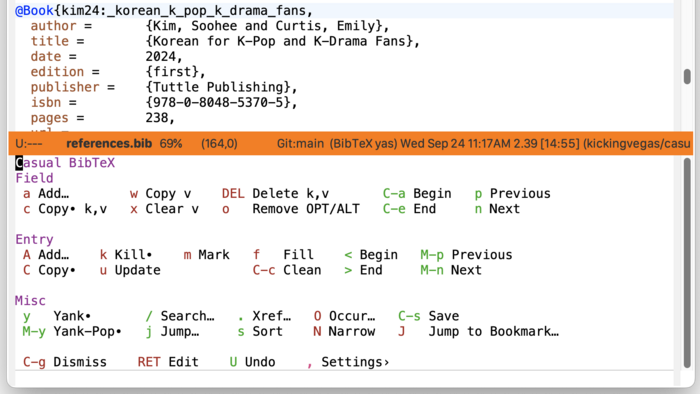
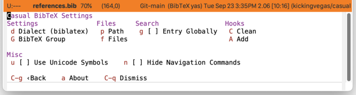
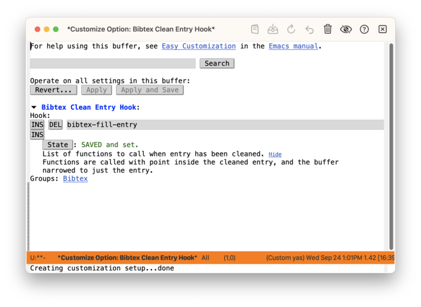
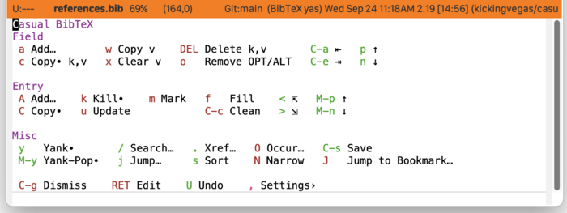

* BibTeX
#+CINDEX: BibTeX
#+CINDEX: bibtex
#+VINDEX: casual-bibtex

Casual BibTeX (library: ~casual-bibtex~) is an opinionated user interface for BibTeX mode ([[info:emacs#TeX Mode][info "(emacs) TeX Mode"]]), a major mode for working with BibTeX files ([[https://bibtex.eu][BibTeX Guide]]).

A BibTeX file is typically named using the suffix ~.bib~ to identify its file type.

To appreciate the benefits of Casual BibTeX, it helps to understand what BibTex is and what BibTeX mode offers.

BibTeX is a database schema for bibliography data. This data is best understood as a collection of records (or entries) that is stored in a plain-text file. Multiple text files can be supported. While most tooling for BibTeX is tuned for LaTeX documentation workflows, BibTeX can be used as generalized storage for bibliography data. Org provides extensive support for citing using BibTeX ([[info:org#Citation handling][info "(org) Citation handling"]]).

As a BibTeX file is plain-text based, any plain-text editor can be used to edit it. This flexibility is problematic as plain-text editors will not enforce the schema of BibTeX by default.

Emacs distinguishes itself from other editors in that support for working with BibTeX files is built-in with the package ~bibtex~.

The ~bibtex~ package provides commands for both navigating and editing BibTeX data structures (entries and the fields within an entry) in a quasi-"form-based" way.

Casual BibTeX organizes and augments BibTeX mode commands into a keyboard-driven menu.

The screenshot below shows the menu for Casual BibTeX.

** BibTeX Install
:PROPERTIES:
:CUSTOM_ID: bibtex-install
:END:

#+CINDEX: BibTeX Install
#+TEXINFO: @subsubheading Simplified Install
#+VINDEX: casual-bibtex-init

If Casual is installed using ~package-install~, then you can use ~casual-init~ to setup support for BibTeX.

By default, ~casual-init~ will setup support for BibTeX via the hook function ~casual-bibtex-init~ which is included in the customizable variable ~casual-init-hook~.

Use the command ~customize-variable~ on ~casual-init-hook~ to control inclusion of ~casual-bibtex-init~ via a checkbox interface.

Refer to the Simplified Install ([[#install][Install]]) section for more detail on customizing ~casual-init~.

Casual makes opinionated decisions on the keybindings used in its menus. Such opinions are extended from said menus to the keymap(s) of a particular mode. For BibTeX, this can be controlled via the customizable variable ~casual-bibtex-add-extra-keybindings~ (default ~t~).

#+TEXINFO: @subsubheading Hook Install

Users who want a more granular install of Casual modules can invoke the hook function of interest in their Emacs initialization file.

#+begin_src elisp :lexical no
  (casual-bibtex-init)
#+end_src

#+TEXINFO: @subsubheading Manual Install

For users who have manually installed Casual outside of ~package-install~, the following guidance is offered.

The primary interface for Casual BibTeX is the Transient menu ~casual-bibtex-tmenu~. It is autoloaded ([[info:elisp#Autoload]]) so if Casual is installed via ~package-install~ ([[info:emacs#Package Installation]]) then ~casual-bibtex-tmenu~ can be invoked via ~execute-extended-command~ ({{{kbd(M-x)}}}) without need for modifying your Emacs initialization file.

That said, Casual is designed with the intent of using common (key)bindings across multiple modes to lower cognitive load. This document uses the secondary binding {{{kbd(M-m)}}} for this purpose, but can be changed to user preference. Note that ~casual-bibtex-tmenu~ is intended to be used in conjunction with ~casual-editkit-main-tmenu~. ([[#editkit-install][EditKit Install]]).

There are many ways to configure this binding. Shown below is a straightforward implementation:

#+begin_src elisp :lexical no
  (require 'casual-bibtex) ; load all dependencies including `bibtex'
  (keymap-set bibtex-mode-map "M-m" #'casual-bibtex-tmenu)
#+end_src

If lazy loading of the ~org-bibtex~ package is desired then try using ~eval-after-load~:

#+begin_src elisp :lexical no
  (eval-after-load 'bibtex
    (keymap-set bibtex-mode-map "M-m" #'casual-bibtex-tmenu))
#+end_src

#+TEXINFO: @subsubheading Additional Bindings

~casual-bibtex-tmenu~ is opinionated in making editing and navigation commands emulate a form-based interface ([[https://simple.wikipedia.org/wiki/Form-based_interface#:~:text=A%20form%2Dbased%20interface%20is,the%20fields%20that%20accept%20it.][form-based interface]]) in a ~bibtex-mode~ window. The following keybindings are recommended to support consistent behavior between ~bibtex-mode-map~ and ~casual-bibtex-tmenu~.

#+begin_src elisp :lexical no
  (add-hook 'bibtex-mode-hook 'hl-line-mode)

  (keymap-set bibtex-mode-map "<TAB>" #'bibtex-next-field)
  (keymap-set bibtex-mode-map "<backtab>" #'previous-line)

  (keymap-set bibtex-mode-map "C-n" #'bibtex-next-field)
  (keymap-set bibtex-mode-map "M-n" #'bibtex-next-entry)
  (keymap-set bibtex-mode-map "M-p" #'bibtex-previous-entry)

  (keymap-set bibtex-mode-map "<prior>" #'bibtex-previous-entry)
  (keymap-set bibtex-mode-map "<next>" #'bibtex-next-entry)

  (keymap-set bibtex-mode-map "C-c C-o" #'bibtex-url)
  (keymap-set bibtex-mode-map "C-c C-c" #'casual-bibtex-fill-and-clean)

  (keymap-set bibtex-mode-map "<clear>" #'bibtex-empty-field)
  (keymap-set bibtex-mode-map "M-<clear>" #'bibtex-kill-field)
  (keymap-set bibtex-mode-map "M-DEL" #'bibtex-kill-field)

#+end_src

** BibTeX Usage
#+CINDEX: BibTeX Usage
#+VINDEX: casual-bibtex-tmenu

The main menu for Casual BibTeX (~casual-bibtex-tmenu~) is organized into the following sections:

- Field :: Commands to edit or navigate fields within an entry.
- Entry :: Commands to edit or navigate entries within a BibTeX file.
- Misc :: Miscellaneous BibTeX commands.

*** BibTeX Navigation
#+CINDEX: BibTeX Navigation

Casual BibTeX re-purposes conventional Emacs navigation bindings so that instead of navigating a text edit buffer, it instead navigates BibTeX structures (entry, field).

The following table shows the bindings for BibTeX navigation.

| Binding        | Command                                           |
|----------------+---------------------------------------------------|
| {{{kbd(C-n)}}} | bibtex-next-field (bound to {{{kbd(n)}}} in menu) |
| {{{kbd(C-p)}}} | previous-line (bound to {{{kbd(p)}}} in menu)     |
| {{{kbd(C-a)}}} | casual-bibtex-beginning-of-field                  |
| {{{kbd(C-e)}}} | casual-bibtex-end-of-field                        |
| {{{kbd(M-p)}}} | bibtex-previous-entry                             |
| {{{kbd(M-n)}}} | bibtex-next-entry                                 |
| {{{kbd(<)}}}   | bibtex-beginning-of-entry                         |
| {{{kbd(>)}}}   | bibtex-end-of-entry                               |

*** BibTeX CRUD
#+CINDEX: BibTeX CRUD

In Casual BibTeX, CRUD (CReate, Update, Delete) operations for entry and field structures are intended to be achieved through their respective commands. This contrasts with manual editing of a buffer to achieve the same end, which is prone to errors.

#+TEXINFO: @subsubheading Creating an Entry

To create a new entry, use the “{{{kbd(A)}}} Add…” command. You will be prompted in the mini-buffer with completion support for the entry type. This new entry will be inserted relative to existing entry where the point is with all fields supported by the entry type enumerated.  Fields with the temporary prefix of "ALT" or "OPT" denote a field that is alternate or optional. Use the command “{{{kbd(o)}}} Remove OPT/ALT” to remove this prefix. 

When all desired information for a BibTeX entry has been entered, it can be "cleaned" using the command “{{{kbd(C-c)}}} Clean”. Cleaning an entry will:

1. Generate a unique citation key, if needed.
2. Remove all unused fields.

By default, cleaning an entry will not format (or "fill") the entry. This can be changed by setting the customizable variable ~bibtex-clean-entry-hook~ to include the command ~bibtex-fill-entry~. This can be done from "Hooks" section in the Settings menu ([[#bibtex-settings][Settings)]]. 

#+TEXINFO: @subsubheading Creating a Field

To create a new field, use the “{{{kbd(a)}}} Add…” command. You will be prompted in the mini-buffer with completion support for the field type. This new field will be inserted relative to existing field where the point is.

There are two components to a field:

- key :: the field name, referred to in the menu as 'k'.
- value ::  the value of the field, referred to in the menu as 'v'.

A "brute-force" command to enumerate all fields for an entry is provided by the “{{{kbd(u)}}} Update…” command. Clean the entry to remove all unpopulated fields after using it.
  
#+TEXINFO: @subsubheading BibTeX mode has its own kill-ring

BibTeX has its own kill-ring variable ~bibtex-entry-kill-ring~ which the following menu commands use:

- {{{kbd(c)}}} Copy∙ k,v :: Copy the whole field, both key and value.
- {{{kbd(C)}}} Copy∙ :: Copy the entry.
- {{{kbd(k)}}} Kill∙ :: Kill the entry.
- {{{kbd(y)}}} Yank∙ :: Yank the entry or field.
- {{{kbd(M-y)}}} Yank-Pop∙ :: Yank-pop the entry or field.
  
The "∙" annotation in a menu label denotes commands that do /not/ use the ~kill-ring~, but ~bibtex-entry-kill-ring~ instead.

#+TEXINFO: @subsubheading Search and Jump

The ability to search and jump to a position in a BibTeX database are offered by the following menu commands:

- {{{kbd(/)}}} Search… :: Search the BibTeX database.
- {{{kbd(j)}}} Jump… :: Move point to a citation key.

*** BibTeX Settings
:PROPERTIES:
:CUSTOM_ID: bibtex-settings
:END:
#+CINDEX: BibTeX Settings
#+VINDEX: casual-bibtex-settings-tmenu

The menu ~casual-bibtex-settings-tmenu~ offers access to commonly configured BibTeX mode settings.

Settings are organized into the following sections:

- Settings :: Miscellaneous BibTeX settings.
- Files :: File and path related settings.
- Search :: Search settings.
- Hooks :: Hook settings for cleaning and adding.

#+TEXINFO: @subsubheading BibTeX Clean Hook

By default BibTeX mode does not format (or "fill") an entry upon cleaning. To support filling an entry upon clean, add the command ~bibtex-fill-entry~ to ~bibtex-clean-entry-hook~ using the “{{{kbd(C)}}} Clean” command as shown below:

*** BibTeX Mode Unicode Symbol Support

By enabling “{{{kbd(u)}}} Use Unicode Symbols” from the Settings menu, Casual BibTeX will use Unicode symbols as appropriate in its menus.

For more info on using Unicode symbols, please refer to [[#ux-conventions][UX Conventions]].

