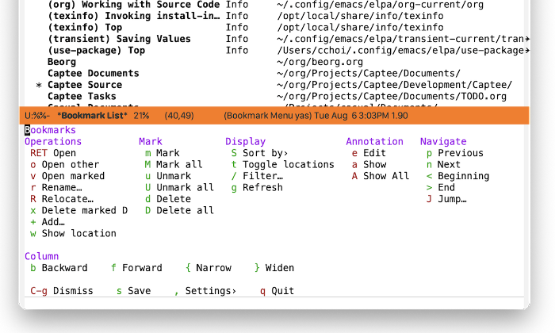
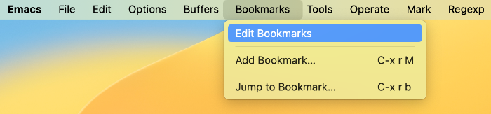
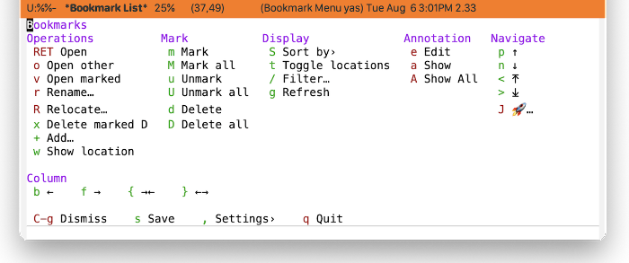

* Bookmarks
#+CINDEX: Bookmarks
#+VINDEX: casual-bookmarks

Casual Bookmarks (library: ~casual-bookmarks~) is a user interface for the Emacs Bookmarks list ([[info:emacs#Bookmarks]]). Its top-level library is ~casual-bookmarks~.

** Bookmarks Install
:PROPERTIES:
:CUSTOM_ID: bookmarks-install
:END:

#+CINDEX: Bookmarks Install

The primary interface for Casual Bookmarks is the Transient menu ~casual-bookmarks-tmenu~. It is autoloaded ([[info:elisp#Autoload]]) so if Casual is installed via ~package-install~ ([[info:emacs#Package Installation]]) then ~casual-bookmarks-tmenu~ can be invoked via ~execute-extended-command~ ({{{kbd(M-x)}}}) without need for modifying your Emacs initialization file.

That said, Casual is designed with the intent of using a common (key)binding across multiple modes to lower cognitive load. This document uses the binding {{{kbd(C-o)}}} for this purpose, but can be changed to user preference.

There are many ways to configure this binding. Shown below is a straightforward implementation:

#+begin_src elisp :lexical no
  (require 'casual-bookmarks) ; load all dependencies including `bookmark'
  (keymap-set bookmark-bmenu-mode-map "C-o" #'casual-bookmarks-tmenu)
#+end_src

If lazy loading of the ~bookmark~ package is desired then try using ~eval-after-load~:

#+begin_src elisp :lexical no
  (eval-after-load 'bookmark
    (keymap-set bookmark-bmenu-mode-map "C-o" #'casual-bookmarks-tmenu))
#+end_src

#+TEXINFO: @subsubheading Additional Bindings

Use this keybinding to configure the bookmark list to be consistent with keybindings used by Casual Bookmarks.

#+begin_src elisp :lexical no
  (keymap-set bookmark-bmenu-mode-map "J" #'bookmark-jump)
#+end_src

Casual Bookmarks also includes the keymap ~casual-bookmarks-main-menu~ which inserts a /Bookmarks/ menu into the main menu bar as shown below.

To enable this, add the following configuration to your initialization file.

#+begin_src elisp :lexical no
  (require 'casual-bookmarks)
  (easy-menu-add-item global-map '(menu-bar)
                      casual-bookmarks-main-menu
                      "Tools")
#+end_src

While not necessary, having the current bookmark highlighted is convenient. Enable  ~hl-line-mode~ for the bookmark list as shown below.

#+begin_src elisp :lexical no
  (require 'hl-line)
  (add-hook 'bookmark-bmenu-mode-hook #'hl-line-mode)
#+end_src

Finally, customize the variable ~bookmark-save-flag~ to the value ~1~ to ensure that your bookmark changes are always saved.

The above guidance largely extends the work done in the blog post [[http://yummymelon.com/devnull/using-bookmarks-in-emacs-like-you-do-in-web-browsers.html][Using Bookmarks in Emacs like you do in Web Browsers]].

** Bookmarks Usage
#+CINDEX: Bookmarks Usage
#+VINDEX: casual-bookmarks-tmenu

Casual Bookmarks organizes its main menu into the following sections:

- Operations :: Commands that can operate on a bookmark such as editing or opening them.

- Mark :: Commands that allow for bulk operation on multiple bookmarks.

- Display :: Control how bookmarks are displayed and filtered.

- Annotation :: Commands for annotating a bookmark.

- Navigation :: Commands for navigating to a bookmark.

- Column :: Commands to navigate and control the display of the table layout for bookmarks.

#+TEXINFO: @subsubheading Sorting
#+VINDEX: casual-bookmarks-sortby-tmenu

Support for sorting the bookmarks list is provided by the menu ~casual-bookmarks-sortby-tmenu~.

#+TEXINFO: @subsubheading Unicode Symbol Support

By enabling “{{{kbd(u)}}} Use Unicode Symbols” from the Settings menu, Casual Bookmarks will use Unicode symbols as appropriate in its menus.

For more info on using Unicode symbols, please refer to [[#ux-conventions][UX Conventions]].
