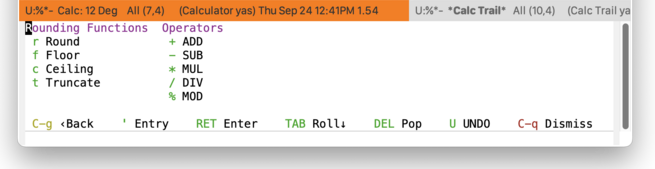
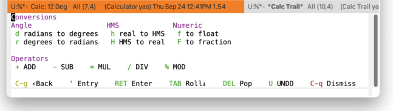
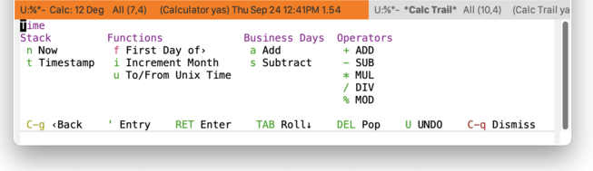
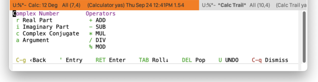

* Calc
#+CINDEX: Calc
#+VINDEX: casual-calc

Casual Calc (library: ~casual-calc~) is a user interface for Emacs Calc ([[info:calc#Top]]).

[[file:images/casual-calc-tmenu.png]]

** Calc Install
:PROPERTIES:
:CUSTOM_ID: calc-install
:END:

#+CINDEX: Calc Install
#+TEXINFO: @subsubheading Simplified Install
#+VINDEX: casual-calc-init

If Casual is installed using ~package-install~, then you can use ~casual-init~ to setup support for Calc.

By default, ~casual-init~ will setup support for Calc via the hook function ~casual-calc-init~ which is included in the customizable variable ~casual-init-hook~.

Use the command ~customize-variable~ on ~casual-init-hook~ to control inclusion of ~casual-calc-init~ via a checkbox interface.

Refer to the Simplified Install ([[#install][Install]]) section for more detail on customizing ~casual-init~.

Casual makes opinionated decisions on the keybindings used in its menus. Such opinions are extended from said menus to the keymap(s) of a particular mode. For Calc, this can be controlled via the customizable variable ~casual-calc-add-extra-keybindings~ (default ~t~).

#+TEXINFO: @subsubheading Hook Install

Users who want a more granular install of Casual modules can invoke the hook function of interest in their Emacs initialization file.

#+begin_src elisp :lexical no
  (casual-calc-init)
#+end_src

#+TEXINFO: @subsubheading Manual Install

For users who have manually installed Casual outside of ~package-install~, the following guidance is offered.

The primary interface for Casual Calc is the Transient menu ~casual-calc-tmenu~. It is autoloaded ([[info:elisp#Autoload]]) so if Casual is installed via ~package-install~ ([[info:emacs#Package Installation]]) then ~casual-calc-tmenu~ can be invoked via ~execute-extended-command~ ({{{kbd(M-x)}}}) without need for modifying your Emacs initialization file.

That said, Casual is designed with the intent of using a common (key)binding across multiple modes to lower cognitive load. This document uses the binding {{{kbd(C-o)}}} for this purpose, but can be changed to user preference.

There are many ways to configure this binding. Shown below is a straightforward implementation:

#+begin_src elisp :lexical no
  (require 'casual-calc) ; load all dependencies including `calc', `calc-ext'
  (keymap-set calc-mode-map "C-o" #'casual-calc-tmenu)
  (keymap-set calc-alg-map "C-o" #'casual-calc-tmenu)
#+end_src

If lazy loading of the ~calc~ and  ~calc-ext~ packages are desired then try the following:

#+begin_src elisp :lexical no
  (eval-after-load 'calc
    (keymap-set calc-mode-map "C-o" #'casual-calc-tmenu))

  (eval-after-load 'calc-ext
    (keymap-set calc-alg-map "C-o" #'casual-calc-tmenu))
#+end_src

** Calc Usage
#+CINDEX: Calc Usage
#+VINDEX: casual-calc-tmenu

[[file:images/casual-calc-tmenu.png]]

To launch Calc, invoke  ~M-x calc~. When the point is in the Calc window, invoke {{{kbd(C-o)}}} (or a binding of your choosing) to launch the Casual Calc interface.

For nearly all menus, algebraic entry via the {{{kbd(')}}} binding is available, as well as basic calculator operations (addition, subtraction, multiplication, division) and stack operations (pop, enter).

#+TEXINFO: @subsubheading Calc Basics

It helps to know some basics about Calc.

- Calc is a stack-based calculator that supports both RPN and algebraic style entry.
  - By default it uses RPN entry, but this can be changed to algebraic.
- Stack based operations are always RPN-style.
- Undo has the keybinding ~U~, redo is ~D~.
- The top of the stack is referred to as ~1:~
- Calc vectors are punctuated with ~[~ and ~]~ (e.g. ~[2 3]~)  Matrix values are represented as vectors within a vector. For example, ~[[1 0] [0 1]]~ is a square diagonal matrix.
- Calc vector indexes are 1-offset.
- Intervals
  - Inclusive intervals are represented as [𝑛..𝑚], where 𝑛 < 𝑚.
  - Exclusive intervals are represented as (𝑛..𝑚), where 𝑛 < 𝑚.
  - Any combination of lower and upper bounds set to be inclusive or exclusive is supported.
- Complex numbers are entered as (𝑟, 𝑖), where 𝑟 is the real part and 𝑖 is the imaginary.
- Radix numbers are entered as 𝑏#𝑛 where 𝑏 is the base value and 𝑛 is the number. For example entering ~2#0101~ will put ~5~ on the stack.
- H:M:S values are default entered as ℎ@ 𝑚" 𝑠'.
- Org-mode active timestamps can be entered into Calc.
- The top of the stack (1:) can be edited by pressing the ~`~ key.
- Entering a single quote (') will prompt you for an algebraic entry.

#+TEXINFO: @subsubheading Calc Menus

Menus provided by Casual Calc are listed below.

*** Calc Main Menu
#+CINDEX: Calc Main Menu
#+VINDEX: casual-calc-tmenu

[[file:images/casual-calc-tmenu.png]]

The main menu for Casual Calc is ~casual-calc-tmenu~. It is organized into the following sections:

- Calc :: Commands for common calculator functions.
    
- Constants ::  Common math constants.
  
- Operators :: Common math operators.
  
- Stack :: Commands for stack operations.
  
- Arithmetic :: Entry point for sub-menus of commands classified as arithmetic operations.
  
- Functions :: Entry point for sub-menus of commands organized into different classes of functionality.
  
- Settings :: Entry point for sub-menus of commands to configure Calc settings.

The commands for each section are detailed below. Stack values are noted with the convention n: where n is the stack index.

#+TEXINFO: @subsubheading Calc

- {{{kbd(&)}}} "1/x" :: Invert 1:
  
- {{{kbd(Q)}}} "sqrt" :: Square root 1:
  
- {{{kbd(n)}}} "+/-" :: Change sign 1:
  
- {{{kbd(^)}}} "y^x" :: Raise 2: to power 1:

- {{{kbd(=)}}} "=" :: Evaluate 1:

- {{{kbd(A)}}} "|x|" :: Absolute value 1:

- {{{kbd(!)}}} "!" ::  Factorial 1:

- {{{kbd(%)}}} "ab%" ::  Apply percentage b (1:) to value a (2:)

  Note this differs from the default ~calc~ behavior of binding {{{kbd(%)}}} to the modulo command ~calc-mod~ to conform with conventional calculators. This difference however is /only/ applied to the menu ~casual-calc-tmenu~.

- {{{kbd(D)}}} "%chg" ::  Compute percentage change from 2: to 1:
  
#+TEXINFO: @subsubheading Constants

- {{{kbd(p)}}} "pi" ::   Insert constant 𝜋 to 1:

- {{{kbd(e)}}} "e" ::   Insert constant 𝑒 to 1:
  

#+TEXINFO: @subsubheading Operators

- {{{kbd(+)}}} "ADD" :: Add 1: to 2:

- {{{kbd(-)}}} "SUB" :: Subtract 1: from 2:

- {{{kbd(*)}}} "MUL" :: Multiply 1: and 2:

- {{{kbd(/)}}} "DIV" :: Divide 1: from 2:

- {{{kbd(M)}}} "MOD" :: Modulo 1: from 2:

  Note this differs from the default ~calc~ behavior of binding {{{kbd(%)}}} to the modulo command ~calc-mod~ to conform with conventional calculators. This difference however is /only/ applied to the menu ~casual-calc-tmenu~.
  

#+TEXINFO: @subsubheading Stack

- {{{kbd(s)}}} "SWAP" :: Exchange 1: with 2:

- {{{kbd(r)}}} "ROLL" :: Roll down all elements in stack
  
- {{{kbd(d)}}} "DROP" :: Remove 1: from stack

- {{{kbd(C)}}} "CLEAR" :: Clear entire stack

- {{{kbd(L)}}} "LAST" :: Push the last arguments popped by the previous command back onto the stack

- {{{kbd(w)}}} "COPY" :: Copy 1: to ~kill-ring~

- {{{kbd(`)}}} "EDIT" :: Edit 1:

- {{{kbd(z)}}} "VAR›" :: Open menu for managing ~calc~ variables
  

#+TEXINFO: @subsubheading Arithmetic

- {{{kbd(o)}}} "ROUND›" :: [[#calc-rounding-menu][Rounding functions menu]]

- {{{kbd(c)}}} "CONV›" :: Conversion functions menu

- {{{kbd(T)}}} "TIME›" :: Time/Date functions menu

- {{{kbd(i)}}} "CPLX›" :: Complex functions menu

- {{{kbd(R)}}} "RAND›" :: Random functions menu

#+TEXINFO: @subsubheading Functions

- {{{kbd(t)}}} "TRIG›" :: Trigonometric functions menu

- {{{kbd(l)}}} "LOG›" :: Logarithmic functions menu

- {{{kbd(b)}}} "BIN›" :: Binary functions menu

- {{{kbd(v)}}} "VEC›" :: Vector/Matrix functions menu

- {{{kbd(u)}}} "UNITS›" :: Unit conversions menu

- {{{kbd(f)}}} "FIN›" :: Financial functions menu

- {{{kbd(g)}}} "GRAPH›" :: Plot functions menu

- {{{kbd(a)}}} "ALG›" :: Symbolic algebra menu
  
#+TEXINFO: @subsubheading Settings

- {{{kbd(\,m)}}} "Settings›" :: Mode, display, and misc settings menu

- {{{kbd(\,s)}}} "Stack›" :: Stack settings menu

- {{{kbd(\,t)}}} "Trail›" :: Trail settings menu

*** Calc Rounding Menu
:PROPERTIES:
:CUSTOM_ID: calc-rounding-menu
:END:
#+CINDEX: Calc Rounding Menu
#+VINDEX: casual-calc-rounding-tmenu

*** Calc Conversions Menu
:PROPERTIES:
:CUSTOM_ID: calc-conversions-menu
:END:
#+CINDEX: Calc Conversions Menu
#+VINDEX: casual-calc-conversions-tmenu

*** Calc Time Menu
:PROPERTIES:
:CUSTOM_ID: calc-time-menu
:END:
#+CINDEX: Calc Time Menu
#+VINDEX: casual-calc-time-tmenu

*** Calc Complex Number Menu
:PROPERTIES:
:CUSTOM_ID: calc-complex number-menu
:END:
#+CINDEX: Calc Complex Number Menu
#+VINDEX: casual-calc-complex-number-tmenu

