* Calc
#+CINDEX: Calc
#+VINDEX: casual-calc

Casual Calc (library: ~casual-calc~) is a user interface for Emacs Calc ([[info:calc#Top]]).

[[file:images/casual-calc-tmenu.png]]

** Calc Install
:PROPERTIES:
:CUSTOM_ID: calc-install
:END:

#+CINDEX: Calc Install
#+TEXINFO: @subsubheading Simplified Install
#+VINDEX: casual-calc-init

If Casual is installed using ~package-install~, then you can use ~casual-init~ to setup support for Calc.

By default, ~casual-init~ will setup support for Calc via the hook function ~casual-calc-init~ which is included in the customizable variable ~casual-init-hook~.

Use the command ~customize-variable~ on ~casual-init-hook~ to control inclusion of ~casual-calc-init~ via a checkbox interface.

Refer to the Simplified Install ([[#install][Install]]) section for more detail on customizing ~casual-init~.

Casual makes opinionated decisions on the keybindings used in its menus. Such opinions are extended from said menus to the keymap(s) of a particular mode. For Calc, this can be controlled via the customizable variable ~casual-calc-add-extra-keybindings~ (default ~t~).

#+TEXINFO: @subsubheading Hook Install

Users who want a more granular install of Casual modules can invoke the hook function of interest in their Emacs initialization file.

#+begin_src elisp :lexical no
  (casual-calc-init)
#+end_src

#+TEXINFO: @subsubheading Manual Install

For users who have manually installed Casual outside of ~package-install~, the following guidance is offered.

The primary interface for Casual Calc is the Transient menu ~casual-calc-tmenu~. It is autoloaded ([[info:elisp#Autoload]]) so if Casual is installed via ~package-install~ ([[info:emacs#Package Installation]]) then ~casual-calc-tmenu~ can be invoked via ~execute-extended-command~ ({{{kbd(M-x)}}}) without need for modifying your Emacs initialization file.

That said, Casual is designed with the intent of using a common (key)binding across multiple modes to lower cognitive load. This document uses the binding {{{kbd(C-o)}}} for this purpose, but can be changed to user preference.

There are many ways to configure this binding. Shown below is a straightforward implementation:

#+begin_src elisp :lexical no
  (require 'casual-calc) ; load all dependencies including `calc', `calc-ext'
  (keymap-set calc-mode-map "C-o" #'casual-calc-tmenu)
  (keymap-set calc-alg-map "C-o" #'casual-calc-tmenu)
#+end_src

If lazy loading of the ~calc~ and  ~calc-ext~ packages are desired then try the following:

#+begin_src elisp :lexical no
  (eval-after-load 'calc
    (keymap-set calc-mode-map "C-o" #'casual-calc-tmenu))

  (eval-after-load 'calc-ext
    (keymap-set calc-alg-map "C-o" #'casual-calc-tmenu))
#+end_src

** Calc Usage
#+CINDEX: Calc Usage
#+VINDEX: casual-calc-tmenu

[[file:images/casual-calc-tmenu.png]]

To launch Calc, invoke  ~M-x calc~. When the point is in the Calc window, invoke {{{kbd(C-o)}}} (or a binding of your choosing) to launch the Casual Calc interface.

For nearly all menus, algebraic entry via the {{{kbd(')}}} binding is available, as well as basic calculator operations (addition, subtraction, multiplication, division) and stack operations (pop, enter).

#+TEXINFO: @subsubheading Calc Basics

It helps to know some basics about Calc.

- Calc is a stack-based calculator that supports both RPN and algebraic style entry.
  - By default it uses RPN entry, but this can be changed to algebraic.

- Stack based operations are always RPN-style.

- Undo has the keybinding ~U~, redo is ~D~.

- The top of the stack is referred to as ~1:~

- Calc vectors are punctuated with ~[~ and ~]~ (e.g. ~[2 3]~)  Matrix values are represented as vectors within a vector. For example, ~[[1 0] [0 1]]~ is a square diagonal matrix.

- Calc vector indexes are 1-offset.

- Intervals
  - Inclusive intervals are represented as [𝑛..𝑚], where 𝑛 < 𝑚.
  - Exclusive intervals are represented as (𝑛..𝑚), where 𝑛 < 𝑚.
  - Any combination of lower and upper bounds set to be inclusive or exclusive is supported.

- Complex numbers are entered as (𝑟, 𝑖), where 𝑟 is the real part and 𝑖 is the imaginary.

- Radix numbers are entered as 𝑏#𝑛 where 𝑏 is the base value and 𝑛 is the number. For example entering ~2#0101~ will put ~5~ on the stack.

- H:M:S values are default entered as ℎ@ 𝑚" 𝑠'.

- Org-mode active timestamps can be entered into Calc.

- The top of the stack (1:) can be edited by pressing the ~`~ key.

- Entering a single quote (') will prompt you for an algebraic entry.

#+TEXINFO: @subsubheading Unicode Symbols

Enable the customizable variable ~casual-lib-use-unicode~ to use Unicode symbols in displaying menu labels.

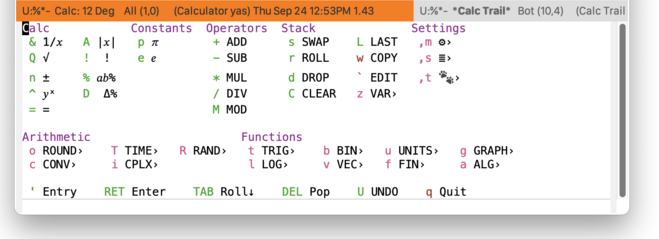

#+TEXINFO: @subsubheading Calc Menus

Menus provided by Casual Calc are listed below.

*** Calc Main Menu
#+CINDEX: Calc Main Menu
#+VINDEX: casual-calc-tmenu

[[file:images/casual-calc-tmenu.png]]

The top-level (or main) menu for Casual Calc is ~casual-calc-tmenu~. It is organized into the following sections:

- Calc :: Commands for common calculator functions.

- Constants ::  Common math constants.

- Operators :: Common math operators.

- Stack :: Commands for stack operations.

- Arithmetic :: Entry point for sub-menus of commands classified as arithmetic operations.

- Functions :: Entry point for sub-menus of commands organized into different classes of functionality.

- Settings :: Entry point for sub-menus of commands to configure Calc settings.

The commands for each section are detailed below. Stack values are noted with the convention n: where n is the stack index.

#+TEXINFO: @subsubheading Calc

- {{{kbd(&)}}} "1/x" :: Invert 1:

- {{{kbd(Q)}}} "sqrt" :: Square root 1:

- {{{kbd(n)}}} "+/-" :: Change sign 1:

- {{{kbd(^)}}} "y^x" :: Raise 2: to power 1:

- {{{kbd(=)}}} "=" :: Evaluate 1:

- {{{kbd(A)}}} "|x|" :: Absolute value 1:

- {{{kbd(!)}}} "!" ::  Factorial 1:

- {{{kbd(%)}}} "ab%" ::  Apply percentage b (1:) to value a (2:)

  Note this differs from the default ~calc~ behavior of binding {{{kbd(%)}}} to the modulo command ~calc-mod~ to conform with conventional calculators. This difference however is /only/ applied to the menu ~casual-calc-tmenu~.

- {{{kbd(D)}}} "%chg" ::  Compute percentage change from 2: to 1:

#+TEXINFO: @subsubheading Constants

- {{{kbd(p)}}} "pi" ::   Insert constant 𝜋 to 1:

- {{{kbd(e)}}} "e" ::   Insert constant 𝑒 to 1:

#+TEXINFO: @subsubheading Operators

- {{{kbd(+)}}} "ADD" :: Add 1: to 2:

- {{{kbd(-)}}} "SUB" :: Subtract 1: from 2:

- {{{kbd(*)}}} "MUL" :: Multiply 1: and 2:

- {{{kbd(/)}}} "DIV" :: Divide 1: from 2:

- {{{kbd(M)}}} "MOD" :: Modulo 1: from 2:

  Note this differs from the default ~calc~ behavior of binding {{{kbd(%)}}} to the modulo command ~calc-mod~ to conform with conventional calculators. This difference however is /only/ applied to the menu ~casual-calc-tmenu~.

#+TEXINFO: @subsubheading Stack

- {{{kbd(s)}}} "SWAP" :: Exchange 1: with 2:

- {{{kbd(r)}}} "ROLL" :: Roll down all elements in stack

- {{{kbd(d)}}} "DROP" :: Remove 1: from stack

- {{{kbd(C)}}} "CLEAR" :: Clear entire stack

- {{{kbd(L)}}} "LAST" :: Push the last arguments popped by the previous command back onto the stack

- {{{kbd(w)}}} "COPY" :: Copy 1: to ~kill-ring~

- {{{kbd(`)}}} "EDIT" :: Edit 1:

- {{{kbd(z)}}} "VAR›" :: Menu for managing ~calc~ [[#calc-variable-menu][variables]]

#+TEXINFO: @subsubheading Arithmetic

- {{{kbd(o)}}} "ROUND›" :: [[#calc-rounding-menu][Rounding functions menu]]

- {{{kbd(c)}}} "CONV›" :: [[#calc-unit-conversions-menu][Conversion functions menu]]

- {{{kbd(T)}}} "TIME›" :: [[#calc-time-menu][Time/Date functions menu]]

- {{{kbd(i)}}} "CPLX›" :: [[#calc-complex-number-menu][Complex functions menu]]

- {{{kbd(R)}}} "RAND›" :: [[#calc-random-number-menu][Random functions menu]]

#+TEXINFO: @subsubheading Functions

- {{{kbd(t)}}} "TRIG›" :: [[#calc-trigonometric-menu][Trigonometric functions menu]]

- {{{kbd(l)}}} "LOG›" :: [[#calc-logarithmic-menu][Logarithmic functions menu]]

- {{{kbd(b)}}} "BIN›" :: [[#calc-binary-menu][Binary functions menu]]

- {{{kbd(v)}}} "VEC›" :: [[#calc-vector-menu][Vector/Matrix functions menu]]

- {{{kbd(u)}}} "UNITS›" :: [[#calc-unit-conversions-menu][Unit conversions menu]]

- {{{kbd(f)}}} "FIN›" :: [[#calc-financial-menu][Financial functions menu]]

- {{{kbd(g)}}} "GRAPH›" :: [[#calc-graph-menu][Plot functions menu]]

- {{{kbd(a)}}} "ALG›" :: [[#calc-symbolic-menu][Symbolic algebra menu]]

#+TEXINFO: @subsubheading Settings

- {{{kbd(\,m)}}} "Settings›" :: [[#calc-modes-menu][Mode, display, and misc settings menu]]

- {{{kbd(\,s)}}} "Stack›" :: [[#calc-stack-settings-menu][Stack settings menu]]

- {{{kbd(\,t)}}} "Trail›" :: [[#calc-trail-settings-menu][Trail settings menu]]

*** Calc Rounding Menu
:PROPERTIES:
:CUSTOM_ID: calc-rounding-menu
:END:
#+CINDEX: Calc Rounding Menu
#+VINDEX: casual-calc-rounding-tmenu

Rounding functions menu (~casual-calc-rounding-tmenu~).

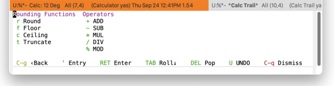

- {{{kbd(r)}}} "Round" :: Round 1: to the nearest integer. When the fractional part is .5 exactly, this command rounds away from zero.

- {{{kbd(f)}}} "Floor" :: Truncates a real number in 1: to the next lower integer, i.e., toward −∞.

- {{{kbd(c)}}} "Ceiling" :: Truncates a real number in 1: toward +∞.

- {{{kbd(t)}}} "Truncate" :: Truncates a real number in 1: toward 0.

*** Calc Conversions Menu
:PROPERTIES:
:CUSTOM_ID: calc-conversions-menu
:END:
#+CINDEX: Calc Conversions Menu
#+VINDEX: casual-calc-conversions-tmenu

Number conversions menu (~casual-calc-conversions-tmenu~). For unit conversions see [[#calc-unit-conversions-menu][Calc Unit Conversions Menu]].

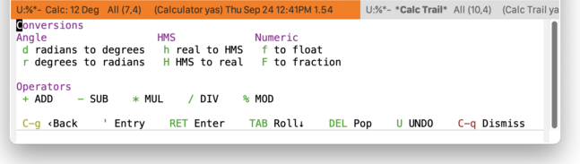

- {{{kbd(d)}}} "radians to degrees" ::

  Convert number in 1: into degrees form.

- {{{kbd(r)}}} "degrees to radians" ::

  Convert number in 1: into an angle in radians form.

- {{{kbd(h)}}} "real to HMS" ::

  Converts a real number, interpreted according to the current angular mode, to an HMS form describing the same angle.

- {{{kbd(H)}}} "HMS to real" ::

  Converts the HMS form on the top of the stack into a real number according to the current angular mode

- {{{kbd(f)}}} "to float" ::

  Converts the number at the top of the stack to floating-point form.

- {{{kbd(F)}}} "to fraction" ::

  Converts a floating-point number into a fractional approximation.

*** Calc Time Menu
:PROPERTIES:
:CUSTOM_ID: calc-time-menu
:END:
#+CINDEX: Calc Time Menu
#+VINDEX: casual-calc-time-tmenu

Time functions menu (~casual-calc-time-tmenu~).

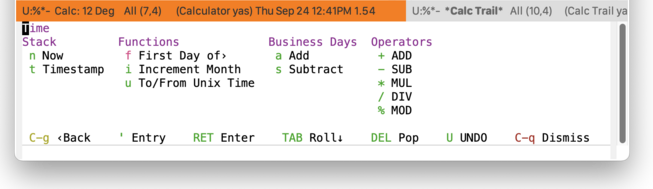

- {{{kbd(n)}}} "Now" ::

  Pushes the current date and time on the stack as a date form.

- {{{kbd(t)}}} "Timestamp" ::

  Push timestamp on stack using ~org-read-date~ interface.

- {{{kbd(f)}}} "First Day of" ::

  First day menu.

- {{{kbd(i)}}} "Increment Month" ::

  Increment timestamp in 1: by a month.

- {{{kbd(u)}}} "To/From Unix Time" ::

  Converts a date form into a Unix time value, which is the number of seconds since midnight on Jan 1, 1970, or vice-versa.

- {{{kbd(a)}}} "Add" ::

  Add business days to 1:

- {{{kbd(s)}}} "Subtract" ::

  Subtract business days from 1:

*** Calc Complex Number Menu
:PROPERTIES:
:CUSTOM_ID: calc-complex-number-menu
:END:
#+CINDEX: Calc Complex Number Menu
#+VINDEX: casual-calc-complex-number-tmenu

Complex number menu (~casual-calc-complex-number-tmenu~).

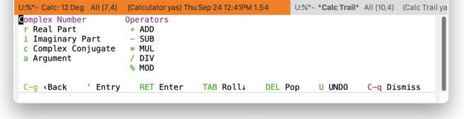

- {{{kbd(r)}}} "Real Part" ::

  Command replaces a complex number by its real part.

- {{{kbd(i)}}} "Imaginary Part" ::

  Command replaces a complex number by its real part; real numbers are converted to zero.

- {{{kbd(c)}}} "Complex Conjugate" ::

  Computes the complex conjugate of a number.

- {{{kbd(a)}}} "Argument" ::

  Computes the "argument" or polar angle of a complex number.

*** Calc Random Number Menu
:PROPERTIES:
:CUSTOM_ID: calc-random-number-menu
:END:
#+CINDEX: Calc Random Number Menu
#+VINDEX: casual-calc-random-number-tmenu

Random number functions menu (~casual-calc-random-number-tmenu~).

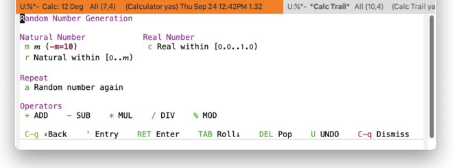

- {{{kbd(m)}}} "m" ::

  Upper bound for computing random integer r whose value
  satisfies 0 ≤ r < m.

- {{{kbd(r)}}} "Natural" ::

  Compute random integer r.

- {{{kbd(c)}}} "Real within [0.0..1.0)" ::

  Compute random float r whose values satisfies 0.0 ≤ r < 1.0.

- {{{kbd(a)}}} "Random number again" ::

  Repeat last random number generation command.

*** Calc Trigonometric Menu
:PROPERTIES:
:CUSTOM_ID: calc-trigonometric-menu
:END:
#+CINDEX: Calc Trigonometric Menu
#+VINDEX: casual-calc-trig-tmenu

Trigonometric functions menu (~casual-calc-trig-tmenu~).

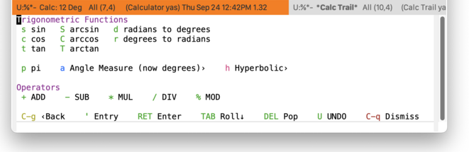

- {{{kbd(s)}}} "sin" ::

  Computes the sine of an angle or complex number. If the input is an HMS form, it is interpreted as degrees-minutes-seconds; otherwise, the input is interpreted according to the current angular mode. It is best to use Radians mode when operating on complex numbers.

- {{{kbd(c)}}} "cos" ::

  Computes the cosine of an angle or complex number.

- {{{kbd(t)}}} "tan" ::

  Computes the tangent of an angle or complex number.

- {{{kbd(S)}}} "arcsin" ::

  Computes the inverse sine of an angle or complex number. The returned argument is converted to degrees, radians, or HMS notation depending on the current angular mode.

- {{{kbd(C)}}} "arccos" ::

  Computes the inverse cosine of an angle or complex number.

- {{{kbd(T)}}} "arctan" ::

  Computes the inverse tangent of an angle or complex number.

- {{{kbd(d)}}} "radians to degrees" ::

  Converts a number into degrees form. The value on the top of the stack may be an HMS form (interpreted as degrees-minutes-seconds), or a real number which will be interpreted in radians regardless of the current angular mode.

- {{{kbd(r)}}} "degress to radians" ::

  Converts an HMS form or angle in degrees into an angle in radians.

- {{{kbd(p)}}} "pi" ::

  Constant 𝜋.

- {{{kbd(a)}}} "Angle Measure›" ::

  Change angle measure.

- {{{kbd(h)}}} "Hyperbolic›" ::

  Hyperbolic trigonometric functions menu.

*** Calc Logarithmic Menu
:PROPERTIES:
:CUSTOM_ID: calc-logarithmic-menu
:END:
#+CINDEX: Calc Logarithmic Menu
#+VINDEX: casual-calc-logarithmic-tmenu

Logarithmic functions menu (~casual-calc-logarithmic-tmenu~).

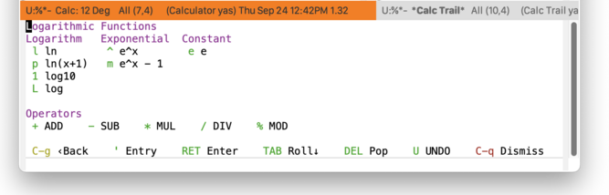

- {{{kbd(l)}}} "ln" ::

  Computes the natural logarithm of the real or complex number on the top of the stack.

- {{{kbd(p)}}} "ln(x+1)" ::

  Computes ‘ln(x+1)’, producing a more accurate answer when ‘x’ is close to zero.

- {{{kbd(1)}}} "log10" ::

  Computes the common (base-10) logarithm of a number. Note that the common logarithm of a complex number is computed by taking the natural logarithm and dividing by ‘ln(10)’.

- {{{kbd(L)}}} "log" ::

  Computes a logarithm of the value (2:) to any base (1:).

- {{{kbd(^)}}} "e^x" ::

  Computes the exponential, i.e., 𝑒 raised to the power of the number on the stack.

- {{{kbd(m)}}} "e^x - 1" ::

  Compute ‘exp(x)-1’, but using an algorithm that produces a more accurate answer when the result is close to zero, i.e., when ‘exp(x)’ is close to one.

- {{{kbd(e)}}} "e" ::

  Constant 𝑒.

*** Calc Binary Menu
:PROPERTIES:
:CUSTOM_ID: calc-binary-menu
:END:
#+CINDEX: Calc Binary Menu
#+VINDEX: casual-calc-binary-tmenu

Binary functions menu (~casual-calc-binary-tmenu~).

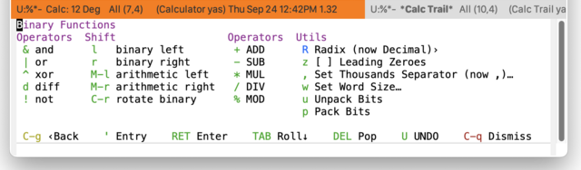

- {{{kbd(&)}}} "and" ::

  Computes the bitwise AND of the two numbers on the top of the stack. In other words, for each of the ‘w’ binary digits of the two numbers (pairwise), the corresponding bit of the result is 1 if and only if both input bits are 1: ‘and(2#1100, 2#1010) = 2#1000’.

- {{{kbd(|)}}} "or" ::

  Computes the bitwise inclusive OR of two numbers. A bit is 1 if either of the input bits, or both, are 1: ‘or(2#1100, 2#1010) = 2#1110’.

- {{{kbd(^)}}} "xor" ::

  Computes the bitwise exclusive OR of two numbers. A bit is 1 if exactly one of the input bits is 1: ‘xor(2#1100, 2#1010) = 2#0110’.

- {{{kbd(d)}}} "diff" ::

  Computes the bitwise difference of two numbers; this is defined by ‘diff(a,b) = and(a,not(b))’, so that ‘diff(2#1100, 2#1010) = 2#0100’.

- {{{kbd(!)}}} "not" ::

  Computes the bitwise NOT of a number. A bit is 1 if the input bit is 0 and vice-versa.

- {{{kbd(l)}}} "binary left" ::

  Shifts a number left by one bit, or by the number of bits specified in the numeric prefix argument. Bits shifted "off the end," according to the current word size, are lost.

- {{{kbd(r)}}} "binary right" ::

  Shifts a number right by one bit, or by the number of bits specified in the numeric prefix argument: ‘rsh(a,n) = lsh(a,-n)’.

- {{{kbd(M-l)}}} "arithmetic left" ::

  "Arithmetic" shifts a number left.

- {{{kbd(M-r)}}} "arithmetic right" ::

  Performs an "arithmetic" shift to the right, in which the leftmost bit (according to the current word size) is duplicated rather than shifting in zeros. This corresponds to dividing by a power of two where the input is interpreted as a signed, twos-complement number. (The distinction between the ‘rsh’ and ‘rash’ operations is totally independent from whether the word size is positive or negative.) With a negative prefix argument, this performs a standard left shift.

- {{{kbd(C-r)}}} "rotate binary" ::

  Rotates a number one bit to the left. The leftmost bit (according to the current word size) is dropped off the left and shifted in on the right. With a numeric prefix argument, the number is rotated that many bits to the left or right.

- {{{kbd(R)}}} "Radix›" ::

  Display Radix menu.

- {{{kbd(z)}}} "Leading Zeroes" ::

  Set variable ~calc-leading-zeroes~. If non-nil, leading zeros are provided to pad integers to ~calc-word-size~.

- {{{kbd(\,)}}} "Set Thousands Separator…" ::

  Set the grouping separator character. The default is the comma character. If you find it difficult to read vectors of large integers grouped with commas, you may wish to use spaces or some other character instead. This command takes the next character you type, whatever it is, and uses it as the digit separator.

- {{{kbd(w)}}} "Set Word Size…" ::

  This command displays a prompt with the current word size; press {{{kbd(RET)}}} immediately to keep this word size, or type a new word size at the prompt. The default word size is 32 bits. All operations except the shifts and rotates allow you to specify a different word size for that one operation by giving a numeric prefix argument.

- {{{kbd(u)}}} "Unpack Bits" ::

  Converts an integer that represents a set in binary into a set in vector/interval notation.

- {{{kbd(p)}}} "Pack Bits" ::

  Convert set in vector/interval notation back to integer that represents a set in binary.

*** Calc Vector/Matrix Menu
:PROPERTIES:
:CUSTOM_ID: calc-vector-menu
:END:
#+CINDEX: Calc Vector/Matrix Menu
#+VINDEX: casual-calc-vector-tmenu

Vector/Matrix functions menu (~casual-calc-vector-tmenu~).

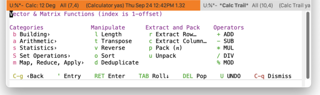

- {{{kbd(b)}}} "Building›" ::

  [[vector-building-functions-menu][Vector building menu]].

- {{{kbd(a)}}} "Arithmetic›" ::

  [[vector-arithmetic-functions-menu][Vector arithmetic menu]].

- {{{kbd(s)}}} "Statistics›" ::

  [[vector-statistics-functions-menu][Vector statistics menu]].

- {{{kbd(S)}}} "Set Operations›" ::

  [[vector-set-operations-functions-menu][Vector set operations menu]].

- {{{kbd(m)}}} "Map, Reduce, Apply›" ::

  [[vector-map-functions-menu][Vector map, reduce, apply functions menu]].

- {{{kbd(l)}}} "Length" ::

  Computes the length of a vector. The length of a non-vector is considered to be zero. Note that matrices are just vectors of vectors for the purposes of this command.

- {{{kbd(t)}}} "Transpose" ::

  Computes the transpose of the matrix at the top of the stack. If the argument is a plain vector, it is treated as a row vector and transposed into a one-column matrix.

- {{{kbd(v)}}} "Reverse" ::

  Reverses a vector end-for-end. Given a matrix, it reverses the order of the rows.

- {{{kbd(o)}}} "Sort" ::

  Sorts the elements of a vector into increasing order. Real numbers, real infinities, and constant interval forms come first in this ordering; next come other kinds of numbers, then variables (in alphabetical order), then finally come formulas and other kinds of objects; these are sorted according to a kind of lexicographic ordering with the useful property that one vector is less or greater than another if the first corresponding unequal elements are less or greater, respectively. Since quoted strings are stored by Calc internally as vectors of ASCII character codes (*note Strings::), this means vectors of strings are also sorted into alphabetical order by this command.

- {{{kbd(d)}}} "Deduplicate" ::

  Sorts the elements of the vector and removes duplicates.

- {{{kbd(r)}}} "Extract Row" ::

  Extracts one row of the matrix on the top of the stack, or one element of the plain vector on the top of the stack. The row or element is specified by the numeric prefix argument; the default is to prompt for the row or element number. The matrix or vector is replaced by the specified row or element in the form of a vector or scalar, respectively.

- {{{kbd(c)}}} "Extract Column" ::

  Analogous operation on columns of a matrix. Given a plain vector it extracts (or removes) one element.

- {{{kbd(p)}}} "Pack (n)" ::

  Given vector size 𝑛 in 1:, assemble a vector using preceding elements on stack. Size of stack must be ≥ (n + 1).

- {{{kbd(u)}}} "Unpack" ::

  Unpacks vector in 1:

#+TEXINFO: @subsubheading Calc Vector Building Menu
#+VINDEX: casual-calc-vector-building-tmenu
#+CINDEX: Calc Vector Building Menu
<<vector-building-functions-menu>>

Vector building functions menu (~casual-calc-vector-building-tmenu~).

- {{{kbd(|)}}} "Concat" :: calc-concat

  Concatenates two vectors into one. If the arguments are matrices, the rows of the first matrix are concatenated with the rows of the second. (In other words, two matrices are just two vectors of row-vectors as far as ‘|’ is concerned.)

- {{{kbd(i)}}} "index (1..𝑛)…" :: calc-index

  Builds a vector of consecutive integers from 1 to N, where N is the numeric prefix argument. If you do not provide a prefix argument, you will be prompted to enter a suitable number. If N is negative, the result is a vector of negative integers from N to -1.

- {{{kbd(e)}}} "Enumerate Interval" :: calc-set-enumerate

  Converts a set of integers into an explicit vector. Intervals in the set are expanded out to lists of all integers encompassed by the intervals. This only works for finite sets (i.e., sets which do not involve ‘-inf’ or ‘inf’).

- {{{kbd(I)}}} "Identity 𝑛…" :: calc-ident

  Builds an identity matrix of the specified size. If no prefix argument is given, this command prompts for one.

- {{{kbd(d)}}} "Diagonal (𝟣:)" :: calc-diag

  Builds a diagonal square matrix. The optional numeric prefix gives the number of rows and columns in the matrix. If the value at the top of the stack is a vector, the elements of the vector are used as the diagonal elements; the prefix, if specified, must match the size of the vector. If the value on the stack is a scalar, it is used for each element on the diagonal, and the prefix argument is required.

- {{{kbd(b)}}} "Build Vector 𝑛…" :: calc-build-vector

  Builds a vector of N copies of the value on the top of the stack, where N is the numeric prefix argument.

- {{{kbd(t)}}} "Transpose" :: calc-transpose

  Computes the transpose of the matrix at the top of the stack. If the argument is a plain vector, it is treated as a row vector and transposed into a one-column matrix.

- {{{kbd(r)}}} "Reverse" :: calc-reverse-vector

  Reverses a vector end-for-end. Given a matrix, it reverses the order of the rows. (To reverse the columns instead, just use ‘v t v v v t’. The same principle can be used to apply other vector commands to the columns of a matrix.)

- {{{kbd(a)}}} "Vector Arrange" :: calc-arrange-vector

  Rearranges a vector to have a certain number of columns and rows. The numeric prefix argument specifies the number of columns; if you do not provide an argument, you will be prompted for the number of columns. The vector or matrix on the top of the stack is “flattened” into a plain vector. If the number of columns is nonzero, this vector is then formed into a matrix by taking successive groups of N elements. If the number of columns does not evenly divide the number of elements in the vector, the last row will be short and the result will not be suitable for use as a matrix.

- {{{kbd(s)}}} "Sort" :: calc-sort

  The ‘V S’ (‘calc-sort’) [‘sort’] command sorts the elements of a vector into increasing order. Real numbers, real infinities, and constant interval forms come first in this ordering; next come other kinds of numbers, then variables (in alphabetical order), then finally come formulas and other kinds of objects; these are sorted according to a kind of lexicographic ordering with the useful property that one vector is less or greater than another if the first corresponding unequal elements are less or greater, respectively. Since quoted strings are stored by Calc internally as vectors of ASCII character codes (*note Strings::), this means vectors of strings are also sorted into alphabetical order by this command.

- {{{kbd(p)}}} "Deduplicate" :: calc-remove-duplicates

  The ‘V +’ (‘calc-remove-duplicates’) [‘rdup’] command converts an arbitrary vector into set notation. It works by sorting the vector as if by ‘V S’, then removing duplicates. (For example, ‘[a, 5, 4, a, 4.0]’ is sorted to ‘[4, 4.0, 5, a, a]’ and then reduced to ‘[4, 5, a]’). Overlapping intervals are merged as necessary. You rarely need to use ‘V +’ explicitly, since all the other set-based commands apply ‘V +’ to their inputs before using them.

- {{{kbd(l)}}} "Length" :: calc-vlength

  The ‘v l’ (‘calc-vlength’) [‘vlen’] command computes the length of a vector. The length of a non-vector is considered to be zero. Note that matrices are just vectors of vectors for the purposes of this command.

- {{{kbd(c)}}} "Vector Count" :: calc-vector-count

  The ‘u #’ (‘calc-vector-count’) [‘vcount’] command computes the number of data values represented by the inputs. For example, ‘vcount(1, [2, 3], [[4, 5], [], x, y])’ returns 7. If the argument is a single vector with no sub-vectors, this simply computes the length of the vector.

- {{{kbd(f)}}} "Vector Find (𝟣:)" :: calc-vector-find

  The ‘v f’ (‘calc-vector-find’) [‘find’] command searches along a vector for the first element equal to a given target. The target is on the top of the stack; the vector is in the second-to-top position. If a match is found, the result is the index of the matching element. Otherwise, the result is zero. The numeric prefix argument, if given, allows you to select any starting index for the search.

- {{{kbd(h)}}} "Histogram" :: calc-histogram

  The ‘V H’ (‘calc-histogram’) [‘histogram’] command builds a histogram of a vector of numbers. Vector elements are assumed to be integers or real numbers in the range [0..N) for some "number of bins" N, which is the numeric prefix argument given to the command. The result is a vector of N counts of how many times each value appeared in the original vector. Non-integers in the input are rounded down to integers. Any vector elements outside the specified range are ignored. (You can tell if elements have been ignored by noting that the counts in the result vector don't add up to the length of the input vector.)

#+TEXINFO: @subsubheading Calc Vector Arithmetic Menu
#+CINDEX: Calc Vector Arithmetic Menu
#+VINDEX: casual-calc-vector-arithmetic-tmenu
<<vector-arithmetic-functions-menu>>

Vector arithmetic functions menu (~casual-calc-vector-arithmetic-tmenu~).

- {{{kbd(t)}}} "Conjugate Transpose" :: calc-conj-transpose

  The ‘V J’ (‘calc-conj-transpose’) [‘ctrn’] command computes the conjugate transpose of its argument, i.e., ‘conj(trn(x))’.

- {{{kbd(A)}}} "Frobenius Norm (|𝑛|)" :: calc-abs

  The ‘A’ (‘calc-abs’) [‘abs’] command computes the absolute value of a number. The result of ‘abs’ is always a nonnegative real number: With a complex argument, it computes the complex magnitude. With a vector or matrix argument, it computes the Frobenius norm, i.e., the square root of the sum of the squares of the absolute values of the elements. The absolute value of an error form is defined by replacing the mean part with its absolute value and leaving the error part the same. The absolute value of a modulo form is undefined. The absolute value of an interval is defined in the obvious way.

- {{{kbd(r)}}} "Row Norm" :: calc-rnorm

  The ‘v n’ (‘calc-rnorm’) [‘rnorm’] command computes the infinity-norm of a vector, or the row norm of a matrix. For a plain vector, this is the maximum of the absolute values of the elements. For a matrix, this is the maximum of the row-absolute-value-sums, i.e., of the sums of the absolute values of the elements along the various rows.

- {{{kbd(c)}}} "Column Norm" :: calc-cnorm

  The ‘V N’ (‘calc-cnorm’) [‘cnorm’] command computes the one-norm of a vector, or column norm of a matrix. For a plain vector, this is the sum of the absolute values of the elements. For a matrix, this is the maximum of the column-absolute-value-sums. General ‘k’-norms for ‘k’ other than one or infinity are not provided. However, the 2-norm (or Frobenius norm) is provided for vectors by the ‘A’ (‘calc-abs’) command.

- {{{kbd(p)}}} "RH Cross Product" :: calc-cross

  The ‘V C’ (‘calc-cross’) [‘cross’] command computes the right-handed cross product of two vectors, each of which must have exactly three elements.

- {{{kbd(k)}}} "Kronecker Product" :: calc-kron

  The ‘V K’ (‘calc-kron’) [‘kron’] command computes the Kronecker product of two matrices.

- {{{kbd(&)}}} "Inverse" :: calc-inv

  The ‘&’ (‘calc-inv’) [‘inv’] command computes the reciprocal of a number, i.e., ‘1 / x’. Operating on a square matrix, it computes the inverse of that matrix.

- {{{kbd(d)}}} "Determinant" :: calc-mdet

  The ‘V D’ (‘calc-mdet’) [‘det’] command computes the determinant of a square matrix.

- {{{kbd(l)}}} "LU Decomposition" :: calc-mlud

  The ‘V L’ (‘calc-mlud’) [‘lud’] command computes the LU decomposition of a matrix. The result is a list of three matrices which, when multiplied together left-to-right, form the original matrix. The first is a permutation matrix that arises from pivoting in the algorithm, the second is lower-triangular with ones on the diagonal, and the third is upper-triangular.

- {{{kbd(T)}}} "Trace" :: calc-mtrace

  The ‘V T’ (‘calc-mtrace’) [‘tr’] command computes the trace of a square matrix. This is defined as the sum of the diagonal elements of the matrix.

#+TEXINFO: @subsubheading Calc Vector Statistics Menu
#+CINDEX: Calc Vector Statistics Menu
#+VINDEX: casual-calc-statistics-tmenu
<<vector-statistics-functions-menu>>

Vector statistics functions menu (~casual-calc-statistics-tmenu~).

- {{{kbd(c)}}} "Vector Count" :: calc-vector-count

  The ‘u #’ (‘calc-vector-count’) [‘vcount’] command computes the number of data values represented by the inputs. For example, ‘vcount(1, [2, 3], [[4, 5], [], x, y])’ returns 7. If the argument is a single vector with no sub-vectors, this simply computes the length of the vector.

- {{{kbd(s)}}} "Sum" :: calc-vector-sum

  The ‘u +’ (‘calc-vector-sum’) [‘vsum’] command computes the sum of the data values. The ‘u *’ (‘calc-vector-prod’) [‘vprod’] command computes the product of the data values. If the input is a single flat vector, these are the same as ‘V R +’ and ‘V R *’ (*note Reducing and Mapping::).

- {{{kbd(x)}}} "Max" :: calc-vector-max

  The ‘u X’ (‘calc-vector-max’) [‘vmax’] command computes the maximum of the data values, and the ‘u N’ (‘calc-vector-min’) [‘vmin’] command computes the minimum. If the argument is an interval, this finds the minimum or maximum value in the interval. (Note that ‘vmax([2..6)) = 5’ as described above.) If the argument is an error form, this returns plus or minus infinity.

- {{{kbd(m)}}} "Mean" :: calc-vector-mean

  The ‘u M’ (‘calc-vector-mean’) [‘vmean’] command computes the average (arithmetic mean) of the data values. If the inputs are error forms ‘x +/- s’, this is the weighted mean of the ‘x’ values with weights ‘1 / s^2’. If the inputs are not error forms, this is simply the sum of the values divided by the count of the values.

- {{{kbd(h)}}} "Histogram…" :: calc-histogram

  The ‘V H’ (‘calc-histogram’) [‘histogram’] command builds a histogram of a vector of numbers. Vector elements are assumed to be integers or real numbers in the range [0..N) for some "number of bins" N, which is the numeric prefix argument given to the command. The result is a vector of N counts of how many times each value appeared in the original vector. Non-integers in the input are rounded down to integers. Any vector elements outside the specified range are ignored. (You can tell if elements have been ignored by noting that the counts in the result vector don't add up to the length of the input vector.)

- {{{kbd(e)}}} "Mean Error" :: calc-vector-mean-error

  The ‘I u M’ (‘calc-vector-mean-error’) [‘vmeane’] command computes the mean of the data points expressed as an error form. This includes the estimated error associated with the mean. If the inputs are error forms, the error is the square root of the reciprocal of the sum of the reciprocals of the squares of the input errors. (I.e., the variance is the reciprocal of the sum of the reciprocals of the variances.) If the inputs are plain numbers, the error is equal to the standard deviation of the values divided by the square root of the number of values. (This works out to be equivalent to calculating the standard deviation and then assuming each value's error is equal to this standard deviation.)

- {{{kbd(M)}}} "Median" :: calc-vector-median

  The ‘H u M’ (‘calc-vector-median’) [‘vmedian’] command computes the median of the data values. The values are first sorted into numerical order; the median is the middle value after sorting. (If the number of data values is even, the median is taken to be the average of the two middle values.) The median function is different from the other functions in this section in that the arguments must all be real numbers; variables are not accepted even when nested inside vectors. (Otherwise it is not possible to sort the data values.) If any of the input values are error forms, their error parts are ignored.

- {{{kbd(H)}}} "Harmonic Mean" :: calc-vector-harmonic-mean

  The ‘H I u M’ (‘calc-vector-harmonic-mean’) [‘vhmean’] command computes the harmonic mean of the data values. This is defined as the reciprocal of the arithmetic mean of the reciprocals of the values.

- {{{kbd(g)}}} "Geometric Mean" :: calc-vector-geometric-mean

  The ‘u G’ (‘calc-vector-geometric-mean’) [‘vgmean’] command computes the geometric mean of the data values. This is the Nth root of the product of the values. This is also equal to the ‘exp’ of the arithmetic mean of the logarithms of the data values.

- {{{kbd(r)}}} "Root Mean Square" :: calc-vector-rms

- {{{kbd(1)}}} "Standard Deviation" :: calc-vector-sdev

  The ‘u S’ (‘calc-vector-sdev’) [‘vsdev’] command computes the standard deviation of the data values. If the values are error forms, the errors are used as weights just as for ‘u M’. This is the _sample_ standard deviation, whose value is the square root of the sum of the squares of the differences between the values and the mean of the ‘N’ values, divided by ‘N-1’.

- {{{kbd(2)}}} "Population Standard Deviation" :: calc-vector-pop-sdev

  The ‘I u S’ (‘calc-vector-pop-sdev’) [‘vpsdev’] command computes the _population_ standard deviation. It is defined by the same formula as above but dividing by ‘N’ instead of by ‘N-1’. The population standard deviation is used when the input represents the entire set of data values in the distribution; the sample standard deviation is used when the input represents a sample of the set of all data values, so that the mean computed from the input is itself only an estimate of the true mean.

- {{{kbd(3)}}} "Variance" :: calc-vector-variance

  The ‘H u S’ (‘calc-vector-variance’) [‘vvar’] and ‘H I u S’ (‘calc-vector-pop-variance’) [‘vpvar’] commands compute the variance of the data values. The variance is the square of the standard deviation, i.e., the sum of the squares of the deviations of the data values from the mean. (This definition also applies when the argument is a distribution.)

- {{{kbd(4)}}} "Population Variance" :: calc-vector-pop-variance

  The ‘H u S’ (‘calc-vector-variance’) [‘vvar’] and ‘H I u S’ (‘calc-vector-pop-variance’) [‘vpvar’] commands compute the variance of the data values. The variance is the square of the standard deviation, i.e., the sum of the squares of the deviations of the data values from the mean. (This definition also applies when the argument is a distribution.)

- {{{kbd(5)}}} "Covariance" :: calc-vector-covariance

  The ‘u C’ (‘calc-vector-covariance’) [‘vcov’] command computes the sample covariance of two vectors. The covariance of vectors X and Y is the sum of the products of the differences between the elements of X and the mean of X times the differences between the corresponding elements of Y and the mean of Y, all divided by ‘N-1’. Note that the variance of a vector is just the covariance of the vector with itself. Once again, if the inputs are error forms the errors are used as weight factors. If both X and Y are composed of error forms, the error for a given data point is taken as the square root of the sum of the squares of the two input errors.

- {{{kbd(6)}}} "Population Covariance" :: calc-vector-pop-covariance

  The ‘I u C’ (‘calc-vector-pop-covariance’) [‘vpcov’] command computes the population covariance, which is the same as the sample covariance computed by ‘u C’ except dividing by ‘N’ instead of ‘N-1’.

- {{{kbd(7)}}} "Correlation" :: calc-vector-correlation

  The ‘H u C’ (‘calc-vector-correlation’) [‘vcorr’] command computes the linear correlation coefficient of two vectors. This is defined by the covariance of the vectors divided by the product of their standard deviations. (There is no difference between sample or population statistics here.)

#+TEXINFO: @subsubheading Calc Vector Set Operations Menu
#+CINDEX: Calc Vector Set Operations Menu
#+VINDEX: casual-calc-set-operations-tmenu
<<vector-set-operations-functions-menu>>

Vector set operations functions menu (~casual-calc-set-operations-tmenu~).

- {{{kbd(d)}}} "Deduplicate" :: calc-remove-duplicates

  The ‘V +’ (‘calc-remove-duplicates’) [‘rdup’] command converts an arbitrary vector into set notation. It works by sorting the vector as if by ‘V S’, then removing duplicates. (For example, ‘[a, 5, 4, a, 4.0]’ is sorted to ‘[4, 4.0, 5, a, a]’ and then reduced to ‘[4, 5, a]’). Overlapping intervals are merged as necessary. You rarely need to use ‘V +’ explicitly, since all the other set-based commands apply ‘V +’ to their inputs before using them.

- {{{kbd(u)}}} "Union" :: calc-set-union

  The ‘V V’ (‘calc-set-union’) [‘vunion’] command computes the union of two sets. An object is in the union of two sets if and only if it is in either (or both) of the input sets. (You could accomplish the same thing by concatenating the sets with ‘|’, then using ‘V +’.)

- {{{kbd(i)}}} "Intersect" :: calc-set-intersect

  The ‘V ^’ (‘calc-set-intersect’) [‘vint’] command computes the intersection of two sets. An object is in the intersection if and only if it is in both of the input sets. Thus if the input sets are disjoint, i.e., if they share no common elements, the result will be the empty vector ‘[]’. Note that the characters ‘V’ and ‘^’ were chosen to be close to the conventional mathematical notation for set union and intersection.

- {{{kbd(D)}}} "Difference" :: calc-set-difference

  The ‘V -’ (‘calc-set-difference’) [‘vdiff’] command computes the difference between two sets. An object is in the difference ‘A - B’ if and only if it is in ‘A’ but not in ‘B’. Thus subtracting ‘[y,z]’ from a set will remove the elements ‘y’ and ‘z’ if they are present. You can also think of this as a general “set complement” operator; if ‘A’ is the set of all possible values, then ‘A - B’ is the "complement" of ‘B’. Obviously this is only practical if the set of all possible values in your problem is small enough to list in a Calc vector (or simple enough to express in a few intervals).

- {{{kbd(x)}}} "xor" :: calc-set-xor

  The ‘V X’ (‘calc-set-xor’) [‘vxor’] command computes the "exclusive-or," or "symmetric difference" of two sets. An object is in the symmetric difference of two sets if and only if it is in one, but _not_ both, of the sets. Objects that occur in both sets "cancel out."

- {{{kbd(~)}}} "Complement" :: calc-set-complement

  The ‘V ~’ (‘calc-set-complement’) [‘vcompl’] command computes the complement of a set with respect to the real numbers. Thus ‘vcompl(x)’ is equivalent to ‘vdiff([-inf .. inf], x)’. For example, ‘vcompl([2, (3 .. 4]])’ evaluates to ‘[[-inf .. 2), (2 .. 3], (4 .. inf]]’.

- {{{kbd(#)}}} "Cardinality" :: calc-set-cardinality

  The ‘V #’ (‘calc-set-cardinality’) [‘vcard’] command counts the number of integers in a set. The result is the length of the vector that would be produced by ‘V E’, although the computation is much more efficient than actually producing that vector.

#+TEXINFO: @subsubheading Calc Vector Map, Reduce, Apply Menu
#+CINDEX: Calc Vector Map, Reduce, Apply Menu
#+VINDEX: casual-calc-map-and-reduce-tmenu
<<vector-map-functions-menu>>

Vector map, reduce, apply functions menu (~casual-calc-map-and-reduce-tmenu~).

*** Calc Unit Conversions Menu
:PROPERTIES:
:CUSTOM_ID: calc-unit-conversions-menu
:END:
#+CINDEX: Calc Unit Conversions Menu
#+VINDEX: casual-calc-units-tmenu

Unit conversions menu (~casual-calc-units-tmenu~).

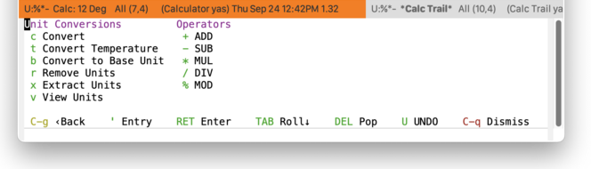

*** Calc Financial Menu
:PROPERTIES:
:CUSTOM_ID: calc-financial-menu
:END:
#+CINDEX: Calc Financial Menu
#+VINDEX: casual-calc-financial-tmenu

Financial functions menu (~casual-calc-financial-tmenu~).

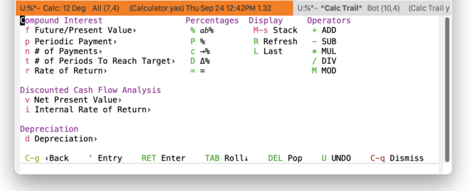

*** Calc Graph/Plot Menu
:PROPERTIES:
:CUSTOM_ID: calc-graph-menu
:END:
#+CINDEX: Calc Graph/Plot Menu
#+VINDEX: casual-calc-plot-tmenu

Graph/Plot menu (~casual-calc-plot-tmenu~).

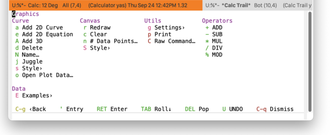

*** Calc Symbolic Algebra Menu
:PROPERTIES:
:CUSTOM_ID: calc-symbolic-menu
:END:
#+CINDEX: Calc Symbolic Algebra Menu
#+VINDEX: casual-calc-symbolic-tmenu

Symbolic algebra menu (~casual-calc-symbolic-tmenu~).

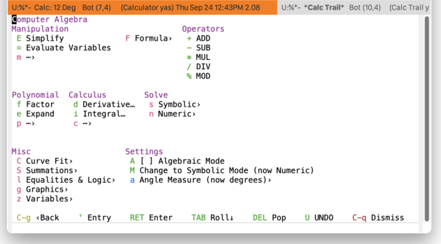

*** Calc Variables Menu
:PROPERTIES:
:CUSTOM_ID: calc-variable-menu
:END:
#+CINDEX: Calc Variables Menu
#+VINDEX: casual-calc-variable-crud-tmenu

Variable menu (~casual-calc-variable-crud-tmenu~).

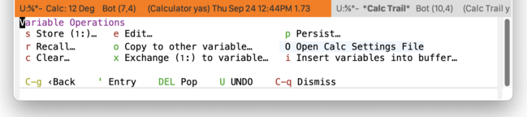

*** Calc Settings Menu
:PROPERTIES:
:CUSTOM_ID: calc-modes-menu
:END:
#+CINDEX: Calc Settings Menu
#+VINDEX: casual-calc-modes-tmenu

Modes, Display and Settings menu (~casual-calc-modes-tmenu~).

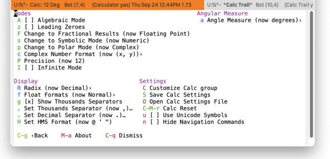

*** Calc Stack Settings Menu
:PROPERTIES:
:CUSTOM_ID: calc-stack-settings-menu
:END:
#+CINDEX: Calc Stack Settings Menu
#+VINDEX: casual-calc-stack-display-tmenu

Stack settings menu (~casual-calc-stack-display-tmenu~).

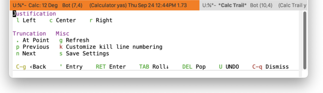

*** Calc Trail Settings Menu
:PROPERTIES:
:CUSTOM_ID: calc-trail-settings-menu
:END:
#+CINDEX: Calc Trail Settings Menu
#+VINDEX: casual-calc-trail-tmenu

Trail settings menu (~casual-calc-trail-tmenu~).

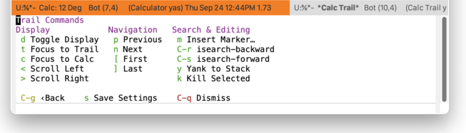
