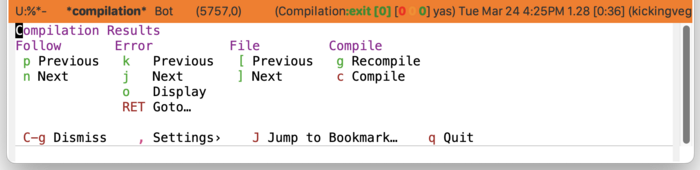
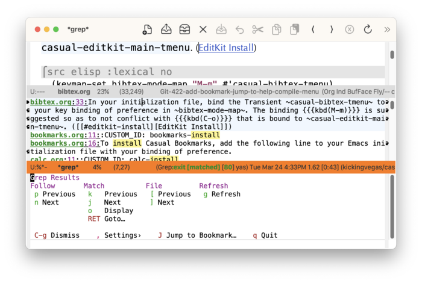

* Compile
#+CINDEX: Compile
#+CINDEX: compilation-mode
#+CINDEX: grep-mode
#+VINDEX: casual-compile

Casual Compile (library: ~casual-compile~) is a user interface for the output of the ~compile~ command ([[info:emacs#Compilation]]). The output buffer's major mode is ~compilation-mode~ whose commands are surfaced by Casual Compile.

In similar fashion, output of Emacs-wrapped Grep commands ([[info:emacs#Grep Searching]]) is also supported by Casual Compile. This is because the output of Grep commands use the major mode ~grep-mode~ which is derived from ~compilation-mode~. 

The screenshot below shows the menu for compilation results.

The screenshot below shows the menu for Grep results. Note the menu label changes based on the output mode (in this case ~grep-mode~).

** Compile Install
:PROPERTIES:
:CUSTOM_ID: compile-install
:END:

#+CINDEX: Compile Install
#+TEXINFO: @subsubheading Simplified Install
#+VINDEX: casual-compile-init

If Casual is installed using ~package-install~, then you can use ~casual-init~ to setup support for Compile and Grep.

By default, ~casual-init~ will setup support for Compile via the hook function ~casual-compile-init~ which is included in the customizable variable ~casual-init-hook~. The same goes for the hook function ~casual-grep-init~.

Use the command ~customize-variable~ on ~casual-init-hook~ to control inclusion of ~casual-compile-init~ via a checkbox interface.

Refer to the Simplified Install ([[#install][Install]]) section for more detail on customizing ~casual-init~.

Casual makes opinionated decisions on the keybindings used in its menus. Such opinions are extended from said menus to the keymap(s) of a particular mode. For Compile, this can be controlled via the customizable variable ~casual-compile-add-extra-keybindings~ (default ~t~). For Grep, this can be controlled via the customizable variable ~casual-grep-add-extra-keybindings~ (default ~t~).

#+TEXINFO: @subsubheading Hook Install

Users who want a more granular install of Casual modules can invoke the hook function of interest in their Emacs initialization file.

#+begin_src elisp :lexical no
  (casual-compile-init)
  (casual-grep-init)
#+end_src

#+TEXINFO: @subsubheading Manual Install

For users who have manually installed Casual outside of ~package-install~, the following guidance is offered.

The primary interface for Casual Compile is the Transient menu ~casual-compile-tmenu~. It is autoloaded ([[info:elisp#Autoload]]) so if Casual is installed via ~package-install~ ([[info:emacs#Package Installation]]) then ~casual-compile-tmenu~ can be invoked via ~execute-extended-command~ ({{{kbd(M-x)}}}) without need for modifying your Emacs initialization file.

That said, Casual is designed with the intent of using a common (key)binding across multiple modes to lower cognitive load. This document uses the binding {{{kbd(C-o)}}} for this purpose, but can be changed to user preference.

There are many ways to configure this binding. Shown below is a straightforward implementation:

#+begin_src elisp :lexical no
  (require 'casual-compile) ; load all dependencies including `compile', `grep'
  (keymap-set compilation-mode-map "C-o" #'casual-compile-tmenu)
  (keymap-set grep-mode-map "C-o" #'casual-compile-tmenu)
#+end_src

If lazy loading of the ~compile~ package is desired then try using ~eval-after-load~:

#+begin_src elisp :lexical no
  (eval-after-load 'compile
    (keymap-set compile-mode-map "C-o" #'casual-compile-tmenu))
  
  (eval-after-load 'grep
    (keymap-set grep-mode-map "C-o" #'casual-compile-tmenu))
#+end_src

#+TEXINFO: @subsubheading Additional Bindings

~casual-compile-tmenu~ deviates from the default bindings of ~compilation-mode-map~ as shown in the table below to support using a single key on an =en.US= keyboard. 

| Default Binding | Casual Binding | Command                    |
|-----------------+----------------+----------------------------|
| M-p             | k              | compilation-previous-error |
| M-n             | j              | compilation-next-error     |
| M-{             | [              | compilation-previous-file  |
| M-}             | ]              | compilation-next-file      |
| C-o             | o              | compilation-display-error  |

The following keybindings are recommended to support consistent behavior between ~compilation-mode-map~ and ~casual-compile-tmenu~.

#+begin_src elisp :lexical no
  (keymap-set compilation-mode-map "k" #'compilation-previous-error)
  (keymap-set compilation-mode-map "j" #'compilation-next-error)
  (keymap-set compilation-mode-map "o" #'compilation-display-error)
  (keymap-set compilation-mode-map "[" #'compilation-previous-file)
  (keymap-set compilation-mode-map "]" #'compilation-next-file)
#+end_src

Similar treatment for ~grep-mode-map~ can be done. 

#+BEGIN_SRC elisp :lexical no
  (keymap-set grep-mode-map "k" #'compilation-previous-error)
  (keymap-set grep-mode-map "j" #'compilation-next-error)
  (keymap-set grep-mode-map "o" #'compilation-display-error)
  (keymap-set grep-mode-map "[" #'compilation-previous-file)
  (keymap-set grep-mode-map "]" #'compilation-next-file)
#+END_SRC

** Compile Usage
#+CINDEX: Compile Usage
#+VINDEX: casual-compile-tmenu

After running ~compile~, invoke ~casual-compile-tmenu~ in the buffer named =✳︎compilation✳︎= using the binding ~C-o~ (or your binding of preference).

The following sections are offered in the menu:

- Follow :: Navigate the point while opening the location of the error in the source file in another window.
- Error :: Error commands for navigation and viewing.
- File :: If there are errors in multiple files, navigate to the file.
- Compile :: Get compile for different Elisp types. Note that the “{{{kbd(k)}}} Kill” item is displayed when there is a running job.

If the output window is from a Grep command, ~casual-compile-tmenu~ will adjust its labels accordingly as shown below.

#+TEXINFO: @subsubheading Compile Settings
#+VINDEX: casual-compile-settings-tmenu

The menu ~casual-compile-settings-tmenu~ provides access to different ~compilation-mode~ settings.
  
#+TEXINFO: @subsubheading Compile Mode Unicode Symbol Support

By enabling “{{{kbd(u)}}} Use Unicode Symbols” from the Settings menu, Casual Compile will use Unicode symbols as appropriate in its menus.

For more info on using Unicode symbols, please refer to [[#ux-conventions][UX Conventions]].
