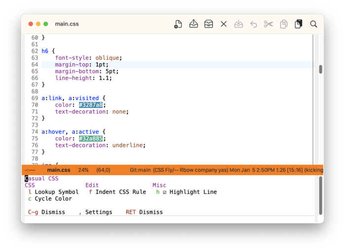
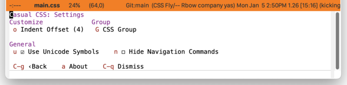

* CSS
:PROPERTIES:
:CUSTOM_ID: css-top
:END:
#+CINDEX: CSS
#+VINDEX: casual-css

Casual CSS (library: ~casual-css~) is a user interface for ~css-mode~. 

Casual also has support for HTML editing ([[#html-top][HTML]]).

** CSS Install
:PROPERTIES:
:CUSTOM_ID: css-install
:END:

#+CINDEX: CSS Install
#+TEXINFO: @subsubheading Simplified Install
#+VINDEX: casual-css-init

If Casual is installed using ~package-install~, then you can use ~casual-init~ to setup support for CSS.

By default, ~casual-init~ will setup support for CSS via the hook function ~casual-css-init~ which is included in the customizable variable ~casual-init-hook~.

Use the command ~customize-variable~ on ~casual-init-hook~ to control inclusion of ~casual-css-init~ via a checkbox interface.

Refer to the Simplified Install ([[#install][Install]]) section for more detail on customizing ~casual-init~.

Casual makes opinionated decisions on the keybindings used in its menus. Such opinions are extended from said menus to the keymap(s) of a particular mode. For CSS, this can be controlled via the customizable variable ~casual-css-add-extra-keybindings~ (default ~t~).

#+TEXINFO: @subsubheading Hook Install

Users who want a more granular install of Casual modules can invoke the hook function of interest in their Emacs initialization file.

#+begin_src elisp :lexical no
  (casual-css-init)
#+end_src

#+TEXINFO: @subsubheading Manual Install

For users who have manually installed Casual outside of ~package-install~, the following guidance is offered.

The primary interface for Casual CSS is the Transient menu ~casual-css-tmenu~. It is autoloaded ([[info:elisp#Autoload]]) so if Casual is installed via ~package-install~ ([[info:emacs#Package Installation]]) then ~casual-css-tmenu~ can be invoked via ~execute-extended-command~ ({{{kbd(M-x)}}}) without need for modifying your Emacs initialization file.

That said, Casual is designed with the intent of using a common (key)bindings across multiple modes to lower cognitive load. This document uses the secondary binding {{{kbd(M-m)}}} for this purpose, but can be changed to user preference. Note that ~casual-css-tmenu~ is intended to be used in conjunction with ~casual-editkit-main-tmenu~. ([[#editkit-install][EditKit Install]]).

There are many ways to configure this binding. Shown below is a straightforward implementation:

#+begin_src elisp :lexical no
  (require 'casual-css) ; load all dependencies including `css-mode'
  (keymap-set css-mode-map "M-m" #'casual-css-tmenu)
#+end_src

If lazy loading of the ~css~ package is desired then try using ~eval-after-load~:

#+begin_src elisp :lexical no
  (eval-after-load 'css-mode
    (keymap-set css-mode-map "M-m" #'casual-css-tmenu))
#+end_src

** CSS Usage
#+CINDEX: CSS Usage
#+VINDEX: casual-css-tmenu

The following sections are offered in the menu:

- CSS :: CSS specific commands.
  - “{{{kbd(l)}}} Lookup Symbol” will reference the symbol's documentation from the Mozilla Developer Network (MDN) website.
  - “{{{kbd(c)}}} Cycle Color” should be selected when the point is on a color specification.
- Edit :: Editing commands.
  - “{{{kbd(f)}}} Indent CSS Rule” is a call to ~fill-paragraph~ whose behavior is adjusted for ~css-mode~.
- Misc :: Miscellaneous commands.
  - “{{{kbd(h)}}} Highlight Line” toggles ~hl-line-mode~ to avoid interfering the display of color specifications.
  

#+TEXINFO: @subsubheading CSS Settings
#+VINDEX: casual-css-settings-tmenu

The menu ~casual-css-settings-tmenu~ provides access to different ~css-mode~ settings.

#+TEXINFO: @subsubheading CSS Unicode Symbol Support

By enabling “{{{kbd(u)}}} Use Unicode Symbols” from the Settings menu, Casual CSS will use Unicode symbols as appropriate in its menus.

For more info on using Unicode symbols, please refer to [[#ux-conventions][UX Conventions]].
