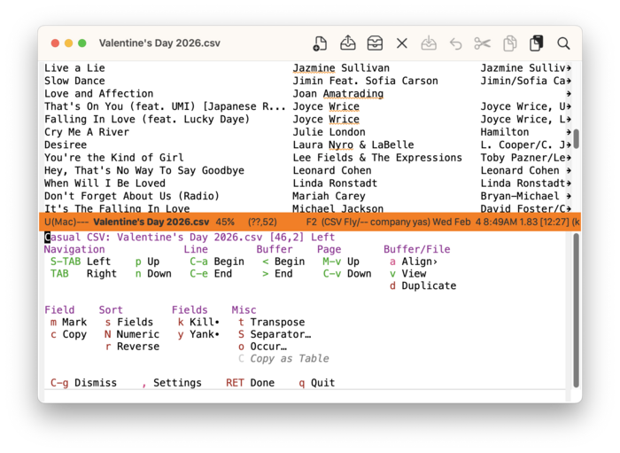
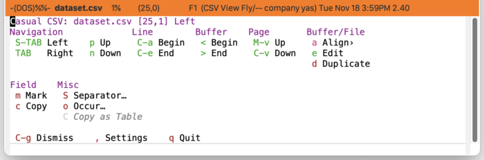
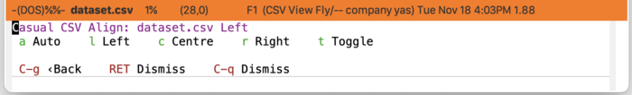
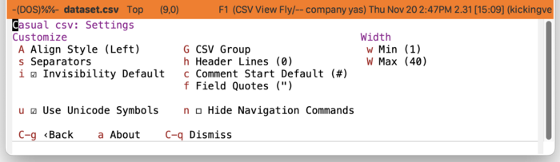
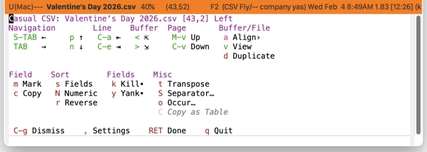

* CSV
#+CINDEX: CSV
#+VINDEX: casual-csv

Casual CSV (library: ~casual-csv~) is a user interface for ~csv-mode~, a mode for working with CSV files.

** CSV Install
:PROPERTIES:
:CUSTOM_ID: csv-install
:END:

#+CINDEX: CSV Install

The primary interface for Casual CSV is the Transient menu ~casual-csv-tmenu~. It is autoloaded ([[info:elisp#Autoload]]) so if Casual is installed via ~package-install~ ([[info:emacs#Package Installation]]) then ~casual-csv-tmenu~ can be invoked via ~execute-extended-command~ ({{{kbd(M-x)}}}) without need for modifying your Emacs initialization file.

That said, Casual is designed with the intent of using a common (key)binding across multiple modes to lower cognitive load. This document uses the secondary binding {{{kbd(M-m)}}} for this purpose, but can be changed to user preference. Note that ~casual-csv-tmenu~ is intended to be used in conjunction with ~casual-editkit-main-tmenu~. ([[#editkit-install][EditKit Install]]).

There are many ways to configure this binding. Shown below is a straightforward implementation:

#+begin_src elisp :lexical no
  (require 'casual-csv) ; load all dependencies including `csv'
  (keymap-set csv-mode-map "M-m" #'casual-csv-tmenu)
#+end_src

If lazy loading of the ~csv~ package is desired then try using ~eval-after-load~:

#+begin_src elisp :lexical no
  (eval-after-load 'csv
    (keymap-set csv-mode-map "M-m" #'casual-csv-tmenu))
#+end_src

#+TEXINFO: @subsubheading Additional Configuration

While not required, the following configuration is recommended for working with CSV files.

#+BEGIN_SRC elisp :lexical no
  ;; disable line wrap
  (add-hook 'csv-mode-hook
            (lambda ()
              (visual-line-mode -1)
              (toggle-truncate-lines 1)))

  ;; auto detect separator
  (add-hook 'csv-mode-hook #'csv-guess-set-separator)
  ;; turn on field alignment
  (add-hook 'csv-mode-hook #'csv-align-mode)
#+END_SRC

** CSV Usage
#+CINDEX: CSV Usage
#+VINDEX: casual-csv-tmenu

The following sections are offered in the menu:

- Navigation, Line, Buffer :: Commands for moving the point, mostly with respect to a field.
- Page :: Move up or down a page.
- Buffer/File :: Commands associated the current buffer or file, such changing the buffer state from viewable (read-only) to editable (writeable), display alignment, or duplicating the file for subsequent editing.
- Field :: Commands to mark or copy a field.
- Sort :: Sorting commands. This section is displayed only if the buffer is editable.
- Fields :: Kill and yank commands dedicated for CSV mode. Note that these commands do /not/ use the default ~kill-ring~ and are marked with a bullet (•). This section is displayed only if the buffer is editable.
- Misc :: Miscellaneous commands. Note if a region is selected containing multiple complete rows, the “{{{kbd(C)}}} Copy as Table” command will reformat the selected rows as an Org table and copy them in the ~kill-ring~ for subsequent pasting.
  
#+TEXINFO: @subsubheading CVS View/Edit, Duplicate

If the buffer is in view (read-only) mode, then only relevant commands are displayed.

If the buffer is editable, a common to desire to instead work on a copy of the CSV file to avoid making unwanted changes. This can be done using the “{{{kbd(d)}}} Duplicate” command.

#+TEXINFO: @subsubheading CSV Align
#+VINDEX: casual-csv-align-tmenu

The display of the CSV buffer can be controlled with the menu ~casual-csv-align-tmenu~.

#+TEXINFO: @subsubheading CSV Settings
#+VINDEX: casual-csv-settings-tmenu

The menu ~casual-csv-settings-tmenu~ provides access to different ~csv-mode~ settings.

#+TEXINFO: @subsubheading CSV Unicode Symbol Support

By enabling “{{{kbd(u)}}} Use Unicode Symbols” from the Settings menu, Casual CSV will use Unicode symbols as appropriate in its menus.

For more info on using Unicode symbols, please refer to [[#ux-conventions][UX Conventions]].
