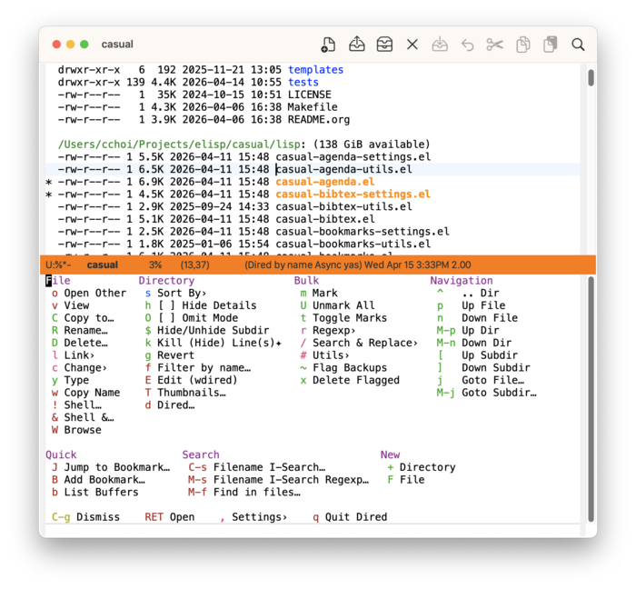
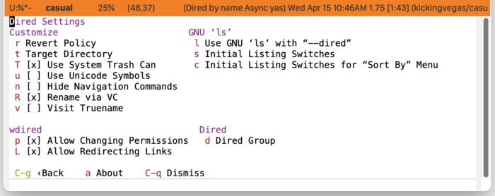
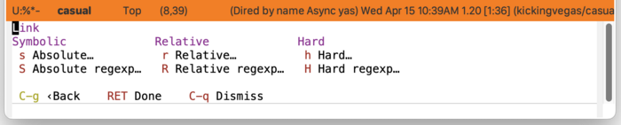
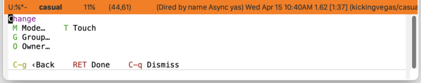
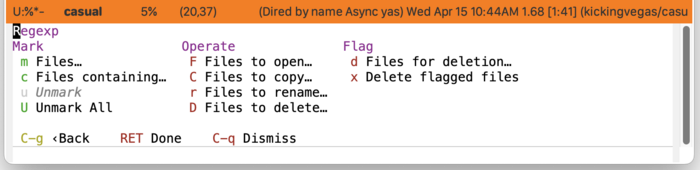
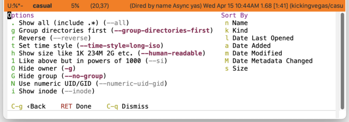
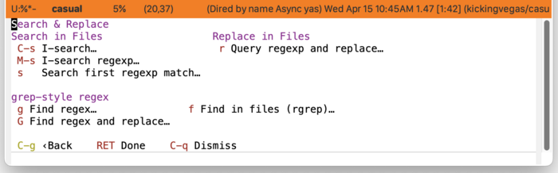
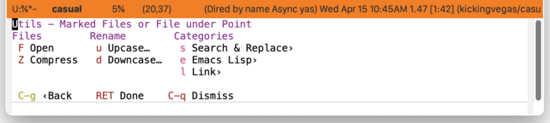
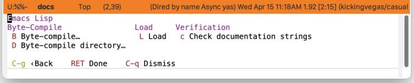
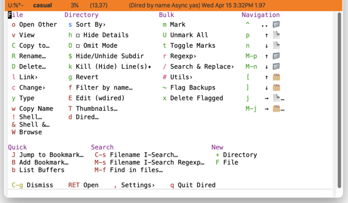

* Dired
#+CINDEX: Dired
#+VINDEX: casual-dired
Casual Dired (library: ~casual-dired~) provides a user interface for Dired ([[info:emacs#Dired]]), the Emacs file manager. Its top-level library is ~casual-dired~.

** Dired Requirements
Casual Dired requires that the ~ls~ utility from GNU coreutils ≥ 8.32 be installed.

The following links provide guidance for installing GNU coreutils on different platforms.

*** macOS
Note that the default packaged ~ls~ on macOS is BSD-flavored which is not supported by Casual Dired. Users wishing to use Casual Dired on macOS are recommended to install GNU coreutils and configure their Emacs to point to its version of ~ls~ accordingly.

- [[https://ports.macports.org/port/coreutils/][MacPorts]]
- [[https://formulae.brew.sh/formula/coreutils#default][Homebrew]]

*** Windows
For users running on Microsoft Windows, use [[https://www.gnu.org/software/emacs/manual/html_node/efaq-w32/Dired-ls.html][this guidance]] to configure Emacs to use an external install of ~ls~.

- [[https://gitforwindows.org/][Git for Windows]] (includes ~ls~ in Git BASH)
- [[https://www.cygwin.com/][Cygwin]]

** Dired Install
:PROPERTIES:
:CUSTOM_ID: dired-install
:END:
#+CINDEX: Dired Install

The main menu for Dired is ~casual-dired-tmenu~. Bind this menu in the keymap ~dired-mode-map~ as follows in your initialization file.

#+begin_src elisp :lexical no
  (keymap-set dired-mode-map "C-o" #'casual-dired-tmenu)
#+end_src

In addition, it is convenient to have both the sort-by (~casual-dired-sort-by-tmenu~) and search & replace (~casual-dired-search-replace-tmenu~) menus bound to ~s~ and ~/~ respectively.

#+begin_src elisp :lexical no
  (keymap-set dired-mode-map "s" #'casual-dired-sort-by-tmenu)
  (keymap-set dired-mode-map "/" #'casual-dired-search-replace-tmenu)
#+end_src

Users who frequently work with Emacs Lisp (Elisp) might consider binding a Dired-specific menu (~casual-dired-elisp-tmenu~) for it.

#+BEGIN_SRC elisp :lexical no
  (keymap-set dired-mode-map "C-c e" #'casual-dired-elisp-tmenu)
#+END_SRC

#+TEXINFO: @subheading Dired Variables

To use Casual Dired, you should have GNU ~ls~ installed and configured so that the customizable variable ~dired-use-ls-dired~ uses it.

The Casual Dired Settings menu gives access to this via the menu key “{{{kbd(l)}}} Use GNU ‘ls’ with --dired”.

#+TEXINFO: @subheading Configuration

The Casual Dired menus have several key bindings that differ from what is default in Dired. The following configuration below can be used to align Dired keybindings with menu keys used by Casual Dired.

#+begin_src elisp :lexical no
  (require 'dired)
  (require 'dired-x)
  (require 'wdired)
  (require 'hl-line)
  (require 'mouse)
  (require 'image-dired)
  (require 'image-dired-dired)
  (require 'casual-dired)

  (keymap-set dired-mode-map "C-o" #'casual-dired-tmenu)
  (keymap-set dired-mode-map "s" #'casual-dired-sort-by-tmenu)
  (keymap-set dired-mode-map "/" #'casual-dired-search-replace-tmenu)
  (keymap-set dired-mode-map "C-c e" #'casual-dired-elisp-tmenu)

  (add-hook 'dired-mode-hook 'hl-line-mode)
  (add-hook 'dired-mode-hook 'context-menu-mode)
  (add-hook 'dired-mode-hook 'dired-async-mode)
  (add-hook
   'dired-mode-hook
   (lambda ()
     (setq-local mouse-1-click-follows-link 'double)))

  (keymap-set dired-mode-map "M-o" #'dired-omit-mode)
  (keymap-set dired-mode-map "E" #'wdired-change-to-wdired-mode)
  (keymap-set dired-mode-map "M-n" #'dired-next-dirline)
  (keymap-set dired-mode-map "M-p" #'dired-prev-dirline)
  (keymap-set dired-mode-map "]" #'dired-next-subdir)
  (keymap-set dired-mode-map "[" #'dired-prev-subdir)
  (keymap-set dired-mode-map "M-]" #'dired-next-marked-file)
  (keymap-set dired-mode-map "M-[" #'dired-prev-marked-file)
  (keymap-set dired-mode-map "A-M-<mouse-1>" #'browse-url-of-dired-file)
  (keymap-set dired-mode-map "<backtab>" #'dired-prev-subdir)
  (keymap-set dired-mode-map "TAB" #'dired-next-subdir)
  (keymap-set dired-mode-map "M-j" #'dired-goto-subdir)
  (keymap-set dired-mode-map ";" #'image-dired-dired-toggle-marked-thumbs)

  (keymap-set image-dired-thumbnail-mode-map "n" #'image-dired-display-next)
  (keymap-set image-dired-thumbnail-mode-map "p" #'image-dired-display-previous)
#+end_src

#+TEXINFO: @subsubheading Dired Sort Context Menu

Included is a standard keymap for Dired sorting commands (~casual-dired-sort-menu~) which can be included in a context menu for a mouse-driven workflow. An example of this is shown below:

#+begin_src elisp :lexical no
  (require 'casual-dired)

  (defun casual-dired-context-menu-addons (menu click)
    "Customize context MENU with CLICK event."
    (easy-menu-add-item menu nil casual-dired-sort-menu)
    menu)

  (add-hook 'context-menu-functions #'casual-dired-context-menu-addons)
  (add-hook 'dired-mode-hook 'context-menu-mode)
#+end_src

If you have Anju installed, you can use its support for ~casual-dired-sort-menu~ instead. More detail in [[https://kickingvegas.github.io/anju/Dired-Mode-Context-Menu.html][Anju Dired Mode Context Menu]].

** Dired Usage
#+CINDEX: Dired Usage
#+VINDEX: casual-dired-tmenu

Invoke ~M-x dired~ to launch Dired. When the point is in the Dired window, invoke {{{kbd(C-o)}}} (or a binding of your choosing) to launch the Casual Dired menu (~casual-dired-tmenu~).

Casual Dired organizes its main menu into the following sections:

- File :: File-related commands are placed here. Many of the commands in this section will work on marked files. More commands that work on marked files are available in the *Bulk* section.

  | Key | Label      | Command                                | Notes             |
  |-----+------------+----------------------------------------+-------------------|
  |  o  | Open Other | dired-find-other-window                |                   |
  |  v  | View       | dired-view-file                        |                   |
  |  C  | Copy to…   | dired-do-copy                          |                   |
  |  R  | Rename…    | dired-do-rename                        |                   |
  |  D  | Delete…    | dired-do-delete                        |                   |
  |  l  | Link›      | casual-dired-link-tmenu                |                   |
  |  c  | Change›    | casual-dired-change-tmenu              |                   |
  |  y  | Type       | dired-show-file-type                   |                   |
  |  w  | Copy Name  | dired-copy-filename-as-kill            |                   |
  |  !  | Shell…     | dired-do-shell-command                 |                   |
  |  &  | Shell &…   | dired-do-async-shell-command           |                   |
  |  ;  | Thumbnail  | image-dired-dired-toggle-marked-thumbs | context-sensitive |
  |  W  | Browse     | browse-url-of-dired-file               |                   |

  
- Directory :: Directory-related commands. Subdir view commands are also made available in this section. To remove a subdir view, use the command prefix {{{kbd(C-u)}}} before pressing the binding {{{kbd(k)}}} to kill a subdir view.

  | Key | Label               | Command                        | Notes             |
  |-----+---------------------+--------------------------------+-------------------|
  | s   | Sort By›            | casual-dired-sort-by-tmenu     |                   |
  | h   | Hide Details        | dired-hide-details-mode        |                   |
  | O   | Omit Mode           | dired-omit-mode                |                   |
  | i   | Insert Subdir       | dired-maybe-insert-subdir      | context-sensitive |
  | $   | Hide/Unhide Subdir  | dired-hide-subdir              | context-sensitive |
  | k   | Kill (Hide) Line(s) | dired-do-kill-lines            | context-sensitive |
  | g   | Revert              | revert-buffer                  |                   |
  | f   | Filter by name…     | casual-dired-find-dired-regexp |                   |
  | E   | Edit (wdired)       | wdired-change-to-wdired-mode   |                   |
  | T   | Thumbnails…         | image-dired                    | context-sensitive |
  | d   | Dired…              | dired                          |                   |

  
- Bulk :: Bulk operations on marked or flagged files.

  | Key | Label             | Command                           | Notes             |
  |-----+-------------------+-----------------------------------+-------------------|
  | m   | Mark              | dired-mark                        | context-sensitive |
  | u   | Unmark            | dired-unmark                      | context-sensitive |
  | U   | Unmark All        | dired-unmark-all-marks            | context-sensitive |
  | t   | Toggle Marks      | dired-toggle-marks                |                   |
  | r   | Regexp›           | casual-dired-regexp-tmenu         |                   |
  | /   | Search & Replace› | casual-dired-search-replace-tmenu |                   |
  | #   | Utils›            | casual-dired-utils-tmenu          |                   |
  | ~   | Flag Backups      | dired-flag-backup-files           |                   |
  | x   | Delete Flagged    | dired-do-flagged-delete           |                   |

  
- Navigation :: Navigation commands to move the point in Dired are offered here.

  | Key | Label        | Unicode | Command                | Notes             |
  |-----+--------------+---------+------------------------+-------------------|
  | ^   | .. Dir       | .. 📁   | dired-up-directory     |                   |
  | p   | Up File      | ↑ 📄    | dired-previous-line    |                   |
  | n   | Down File    | ↓ 📄    | dired-next-line        |                   |
  | M-[ | Up *File     | ↑ *📄   | dired-prev-marked-file | context-sensitive |
  | M-] | Down *File   | ↓ *📄   | dired-next-marked-file | context-sensitive |
  | M-p | Up Dir       | ↑ 📁    | dired-prev-dirline     |                   |
  | M-n | Down Dir     | ↓ 📁    | dired-next-dirline     |                   |
  | [   | Up Subdir    | ↑ 🗂️    | dired-prev-subdir      |                   |
  | ]   | Down Subdir  | ↓ 🗂️    | dired-next-subdir      |                   |
  | j   | Goto File…   | → 📄…   | dired-goto-file        |                   |
  | M-j | Goto Subdir… | → 🗂️…   | dired-goto-subdir      |                   |
 

- Quick :: Convenience commands for bookmarks and listing buffers are made available in this section.

  | Key | Label             | Command                   |
  |-----+-------------------+---------------------------|
  | J   | Jump to Bookmark… | bookmark-jump             |
  | B   | Add Bookmark…     | bookmark-set-no-overwrite |
  | b   | List Buffers      | ibuffer                   |

  
- Search :: Commands to find a filename via I-Search or to recursively search for pattern inside files contained in a directory tree (~rgrep~) are made available here.

  | Key | Label                     | Command                        |
  |-----+---------------------------+--------------------------------|
  | C-s | Filename I-Search…        | dired-isearch-filenames        |
  | M-s | Filename I-Search Regexp… | dired-isearch-filenames-regexp |
  | M-f | Find in files…            | rgrep                          |

  
- New :: Create a new file or directory with the commands in this section.

  | Key | Label     | Command                 |
  |-----+-----------+-------------------------|
  | +   | Directory | dired-create-directory  |
  | F   | File      | dired-create-empty-file |

  
Note that some commands in this menu are /context-sensitive/ and will only appear if the context is appropriate. Commands relating to marked files, subdirs, and image thumbnails are context-sensitive.

The sections below detail the different sub-menus in ~casual-dired-tmenu~.

*** Dired Link (Link›)
#+CINDEX: Dired Link
#+VINDEX: casual-dired-link-tmenu

Create symbolic and hard links ›via the “{{{kbd(l)}}} Link›” menu (~casual-dired-link-tmenu~) in ~casual-dired-tmenu~. Both absolute and relative symbolic links (symlinks) are supported.

| Key | Label            | Command                    |
|-----+------------------+----------------------------|
| s   | Absolute…        | dired-do-symlink           |
| S   | Absolute regexp… | dired-do-symlink-regexp    |
| r   | Relative…        | dired-do-relsymlink        |
| R   | Relative regexp… | dired-do-relsymlink-regexp |
| h   | Hard…            | dired-do-hardlink          |
| H   | Hard regexp…     | dired-do-hardlink-regexp   |

*** Dired Change (Change›)
#+CINDEX: Dired Change
#+VINDEX: casual-dired-change-tmenu

Commands to change file or directory metadata are provided by the Dired Change menu (~casual-dired-change-tmenu~.)

| Key | Label  | Command        |
|-----+--------+----------------|
| M   | Mode…  | dired-do-chmod |
| G   | Group… | dired-do-chgrp |
| O   | Owner… | dired-do-chown |
| T   | Touch  | dired-do-touch |

*** Dired Regexp (Regexp›)
#+CINDEX: Dired Regexp
#+VINDEX: casual-dired-regexp-tmenu

Commands to operate on files or directories based on regular expression (regexp) pattern matching are provided by the Dired Regexp menu (~casual-dired-regexp-tmenu~).

| Key | Label                | Command                            |
|-----+----------------------+------------------------------------|
| m   | Files…               | dired-mark-files-regexp            |
| c   | Files containing…    | dired-mark-files-containing-regexp |
| u   | Unmark               | dired-unmark                       |
| U   | Unmark All           | dired-unmark-all-marks             |
| F   | Files to open…       | dired-do-find-marked-files         |
| C   | Files to copy…       | dired-do-copy-regexp               |
| r   | Files to rename…     | dired-do-rename-regexp             |
| D   | Files to delete…     | dired-do-delete                    |
| d   | Files for deletion…  | dired-flag-files-regexp            |
| x   | Delete flagged files | dired-do-flagged-delete            |

*** Dired Sort By (Sort By›)
#+CINDEX: Dired Sort By
#+VINDEX: casual-dired-sort-by-tmenu

The Dired Sort By menu (~casual-dired-sort-by-tmenu~) provides an interface to configuring GNU ~ls~.

The menu is separated into two sections:

- Options :: Option switches to control how output is displayed.
  
  | Key | Label                            | Option                    | Notes                                  |
  |-----+----------------------------------+---------------------------+----------------------------------------|
  | .   | Show all (include .*)            | --all                     | Control display of hidden (dot) files. |
  | g   | Group directories first          | --group-directories-first |                                        |
  | r   | Reverse                          | --reverse                 |                                        |
  | t   | Set time style                   | --time-style=             |                                        |
  | h   | Show size like 1K 234M 2G etc.   | --human-readable          |                                        |
  | 1   | Like above but in powers of 1000 | --si                      |                                        |
  | O   | Hide owner                       | -g                        |                                        |
  | G   | Hide group                       | --no-group                |                                        |
  | N   | Use numeric UID/GID              | --numeric-uid-gid         |                                        |
  | i   | Show inode                       | --inode                   |                                        |

  Refer to GNU ~ls~ ([[info:coreutils#ls invocation][coreutils#ls invocation]]) for more detail on option behavior.

  
- Sort By :: Commands to sort by a specified criteria.
  
  | Key | Label                 | Command                                     |
  |-----+-----------------------+---------------------------------------------|
  | n   | Name                  | casual-dired--sort-by-name                  |
  | k   | Kind                  | casual-dired--sort-by-kind                  |
  | l   | Date Last Opened      | casual-dired--sort-by-date-last-opened      |
  | a   | Date Added            | casual-dired--sort-by-date-added            |
  | m   | Date Modified         | casual-dired--sort-by-date-modified         |
  | M   | Date Metadata Changed | casual-dired--sort-by-date-metadata-changed |
  | s   | Size                  | casual-dired--sort-by-size                  |

With the *Sort By* menu raised, one can save the switch settings for future use via the binding {{{kbd(C-x C-s)}}} (~transient-save~). Note this is a global setting and will apply to all future calls to the *Sort By* menu.

*** Dired Search & Replace (Search & Replace›)
#+CINDEX: Dired Search & Replace
#+VINDEX: casual-dired-search-replace-tmenu

Search and replace in multiple marked files using the “{{{kbd(/)}}} Search & Replace›” menu  (~casual-dired-search-replace-tmenu~) in ~casual-dired-tmenu~. This will raise a menu of Dired commands that will work on marked files.

While most Dired commands use Emacs-style regular expression syntax ([[info:elisp#Regular Expressions]]),  there are commands that use *grep*-style regex syntax instead as it makes direct calls to ~grep~. This syntax is dependent on the ~grep~ implementation that is installed and used by Emacs.

| Key | Label                      | Command                          | Notes      |
|-----+----------------------------+----------------------------------+------------|
| C-s | I-search…                  | dired-do-isearch                 |            |
| M-s | I-search regexp…           | dired-do-isearch-regexp          |            |
| s   | Search first regexp match… | dired-do-search                  |            |
| r   | Query regexp and replace…  | dired-do-query-replace-regexp    |            |
| g   | Find regex…                | dired-do-find-regexp             | grep regex |
| G   | Find regex and replace…    | dired-do-find-regexp-and-replace | grep regex |
| f   | Find in files (rgrep)…     | rgrep                            | grep regex |

*** Dired Utilities (Utils›)
:PROPERTIES:
:CUSTOM_ID: dired-utilities
:END:
#+CINDEX: Dired Utilities
#+VINDEX: casual-dired-utils-tmenu

Casual Dired organizes a number of Dired commands that work on a set of marked files. These commands are presented in the “{{{kbd(#)}}} Utils›” menu (~casual-dired-utils-tmenu~) in ~casual-dired-tmenu~.

| Key | Label             | Command                           |
|-----+-------------------+-----------------------------------|
| F   | Open              | dired-do-find-marked-files        |
| Z   | Compress          | dired-do-compress                 |
| u   | Upcase…           | dired-upcase                      |
| d   | Downcase…         | dired-downcase                    |
| s   | Search & Replace› | casual-dired-search-replace-tmenu |
| e   | Emacs Lisp›       | casual-dired-elisp-tmenu          |
| l   | Link›             | casual-dired-link-tmenu           |

*** Dired Elisp
#+CINDEX: Dired Elisp
#+VINDEX: casual-dired-elisp-tmenu

Support for running bulk commands for Elisp development are provided by the menu ~casual-dired-elisp-tmenu~. This menu is located in the Utilities menu ([[#dired-utilities][Dired Utilities (Utils›)]]).

| Key | Label                       | Command                  |
|-----+-----------------------------+--------------------------|
| B   | Byte-compile…               | dired-do-byte-compile    |
| D   | Byte-compile directory…     | byte-recompile-directory |
| L   | Load                        | dired-do-load            |
| c   | Check documentation strings | checkdoc-dired           |

*** Dired Settings (Settings›)
#+CINDEX: Dired Settings
#+VINDEX: casual-dired-settings-tmenu

Configure Dired to preference using the Settings menu (~casual-dired-settings-tmenu~).

#+TEXINFO: @subheading Dired Unicode Symbol Support

By enabling {{{kbd(u)}}} “Use Unicode Symbols” from the Settings menu, Casual Dired will use Unicode symbols as appropriate in its menus. 

To ensure proper layout and spacing, your default typeface should be fixed-width or monospace and *must* support the Unicode symbols used.

For more info on using Unicode symbols, please refer to [[#ux-conventions][UX Conventions]].

