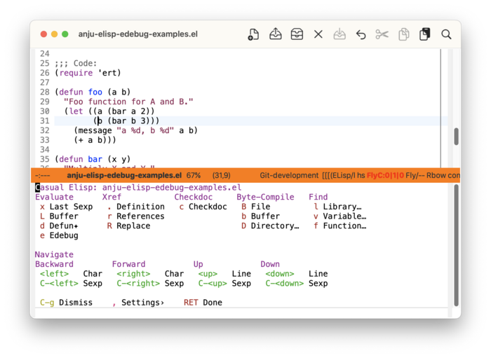
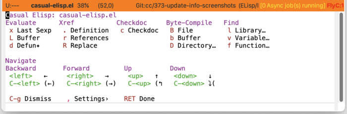

* Elisp
#+CINDEX: Elisp
#+VINDEX: casual-elisp

Casual Elisp (library: ~casual-elisp~) is a user interface for ~emacs-lisp-mode~. It provides a menu for commands useful for Elisp development.

** Elisp Install
:PROPERTIES:
:CUSTOM_ID: elisp-install
:END:

#+CINDEX: Elisp Install
#+TEXINFO: @subsubheading Simplified Install
#+VINDEX: casual-elisp-init

If Casual is installed using ~package-install~, then you can use ~casual-init~ to setup support for Elisp.

By default, ~casual-init~ will setup support for Elisp via the hook function ~casual-elisp-init~ which is included in the customizable variable ~casual-init-hook~.

Use the command ~customize-variable~ on ~casual-init-hook~ to control inclusion of ~casual-elisp-init~ via a checkbox interface.

Refer to the Simplified Install ([[#install][Install]]) section for more detail on customizing ~casual-init~.

Casual makes opinionated decisions on the keybindings used in its menus. Such opinions are extended from said menus to the keymap(s) of a particular mode. For Elisp, this can be controlled via the customizable variable ~casual-elisp-add-extra-keybindings~ (default ~t~).

#+TEXINFO: @subsubheading Hook Install

Users who want a more granular install of Casual modules can invoke the hook function of interest in their Emacs initialization file.

#+begin_src elisp :lexical no
  (casual-elisp-init)
#+end_src

#+TEXINFO: @subsubheading Manual Install

For users who have manually installed Casual outside of ~package-install~, the following guidance is offered.

The primary interface for Casual Elisp is the Transient menu ~casual-elisp-tmenu~. It is autoloaded ([[info:elisp#Autoload]]) so if Casual is installed via ~package-install~ ([[info:emacs#Package Installation]]) then ~casual-elisp-tmenu~ can be invoked via ~execute-extended-command~ ({{{kbd(M-x)}}}) without need for modifying your Emacs initialization file.

That said, Casual is designed with the intent of using a common (key)binding across multiple modes to lower cognitive load. This document uses the secondary binding {{{kbd(M-m)}}} for this purpose, but can be changed to user preference. Note that ~casual-elisp-tmenu~ is intended to be used in conjunction with ~casual-editkit-main-tmenu~. ([[#editkit-install][EditKit Install]]).

There are many ways to configure this binding. Shown below is a straightforward implementation:

#+begin_src elisp :lexical no
  (require 'casual-elisp) ; load all dependencies including `elisp-mode'
  (keymap-set emacs-lisp-mode-map "M-m" #'casual-elisp-tmenu)
#+end_src

If lazy loading of the ~elisp~ package is desired then try using ~eval-after-load~:

#+begin_src elisp :lexical no
  (eval-after-load 'elisp-mode
    (keymap-set emacs-lisp-mode-map "M-m" #'casual-elisp-tmenu))
#+end_src

** Elisp Usage
#+CINDEX: Elisp Usage
#+VINDEX: casual-elisp-tmenu

Invoke the Casual Elisp main menu ~casual-elisp-tmenu~ via the binding {{{kbd(M-m)}}} (or your binding of preference) in an Elisp window. Typically this is whenever an =.el= file is opened.

The following sections are offered in the menu:

- Evaluate :: Commands to evaluate, execute, or debug an Elisp expression ([[info:elisp#Eval]], [[info:elisp#Edebug]]).

- Xref :: Cross-referencing commands ([[info:emacs#Xref]]).

- Checkdoc :: Checks docstrings in the file.

- Byte-Compile :: Commands for byte-compilation ([[info:elisp#Byte Compilation]]).

- Find :: Find commands.

- Navigate :: Commands for Sexp (balanced expression) navigation.

# #+TEXINFO: @subsubheading Elisp Settings
# #+VINDEX: casual-elisp-settings-tmenu

# The menu ~casual-elisp-settings-tmenu~ provides access to different ~emacs-lisp-mode~ settings.

# TODO: Insert screenshot

#+TEXINFO: @subsubheading Elisp Unicode Symbol Support

By enabling “{{{kbd(u)}}} Use Unicode Symbols” from the Settings menu, Casual Elisp will use Unicode symbols as appropriate in its menus.

For more info on using Unicode symbols, please refer to [[#ux-conventions][UX Conventions]].
