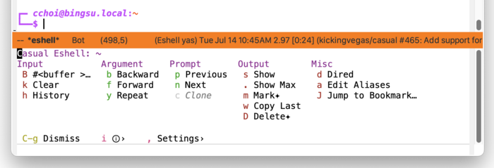
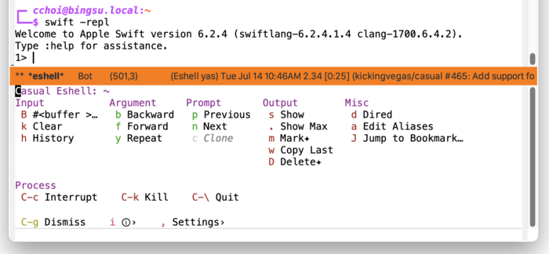
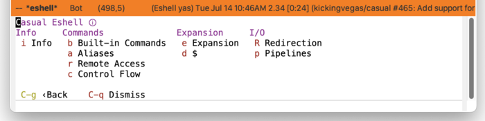
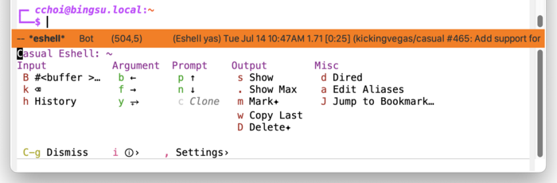

* Eshell
#+CINDEX: Eshell
#+VINDEX: casual-eshell

Casual Eshell (library: ~casual-eshell~) is a user interface for ~Eshell~, a shell-like command interpreter implemented in Emacs Lisp.

** Eshell Install
:PROPERTIES:
:CUSTOM_ID: eshell-install
:END:

#+CINDEX: Eshell Install
#+TEXINFO: @subsubheading Simplified Install
#+VINDEX: casual-eshell-init

If Casual is installed using ~package-install~, then you can use ~casual-init~ to setup support for Eshell.

By default, ~casual-init~ will setup support for Eshell via the hook function ~casual-eshell-init~ which is included in the customizable variable ~casual-init-hook~.

Use the command ~customize-variable~ on ~casual-init-hook~ to control inclusion of ~casual-eshell-init~ via a checkbox interface.

Refer to the Simplified Install ([[#install][Install]]) section for more detail on customizing ~casual-init~.

Casual makes opinionated decisions on the keybindings used in its menus. Such opinions are extended from said menus to the keymap(s) of a particular mode. For Eshell, this can be controlled via the customizable variable ~casual-eshell-add-extra-keybindings~ (default ~t~).

#+TEXINFO: @subsubheading Hook Install

Users who want a more granular install of Casual modules can invoke the hook function of interest in their Emacs initialization file.

#+begin_src elisp :lexical no
  (casual-eshell-init)
#+end_src

#+TEXINFO: @subsubheading Manual Install

For users who have manually installed Casual outside of ~package-install~, the following guidance is offered.

The primary interface for Casual Eshell is the Transient menu ~casual-eshell-tmenu~. It is autoloaded ([[info:elisp#Autoload]]) so if Casual is installed via ~package-install~ ([[info:emacs#Package Installation]]) then ~casual-eshell-tmenu~ can be invoked via ~execute-extended-command~ ({{{kbd(M-x)}}}) without need for modifying your Emacs initialization file.

That said, Casual is designed with the intent of using a common (key)binding across multiple modes to lower cognitive load. This document uses the binding {{{kbd(C-o)}}} for this purpose, but can be changed to user preference.

There are many ways to configure this binding. Shown below is a straightforward implementation:

#+begin_src elisp :lexical no
  (require 'casual-eshell) ; load all dependencies including `eshell'
  (keymap-set eshell-mode-map "C-o" #'casual-eshell-tmenu)
#+end_src

If lazy loading of the ~eshell~ package is desired then try using ~eval-after-load~:

#+begin_src elisp :lexical no
  (eval-after-load 'eshell
    (keymap-set eshell-mode-map "C-o" #'casual-eshell-tmenu))
#+end_src

** Eshell Usage
#+CINDEX: Eshell Usage
#+VINDEX: casual-eshell-tmenu

Eshell can be invoked via ~M-x eshell~. In the Eshell window, press {{{kbd(C-o)}}} (or your binding of preference) to raise the menu ~casual-eshell-tmenu~.

The following sections are offered in the menu:

- Input :: Commands supporting input to the current prompt. 

- Argument :: Commands supporting arguments in the current prompt.

- Prompt :: Navigation of previous prompt commands.

- Output :: Commands related to display of prompt. Commands marked with the glyph ✦ support an optional prefix ({{{kbd(C-u)}}}) value.

- Misc :: Miscellaneous commands.

- Process :: Signal commands to send to the process.
  This section is only visible when a process is running.

    

#+TEXINFO: @subsubheading Eshell Settings
#+VINDEX: casual-eshell-settings-tmenu

The menu ~casual-eshell-settings-tmenu~ provides access to different ~eshell-mode~ settings.

# TODO: Insert screenshot

#+TEXINFO: @subsubheading Eshell Info
#+VINDEX: casual-eshell-info-tmenu

The menu ~casual-eshell-info-tmenu~ provides access to different ~eshell-mode~ documentation in its Info manual.

  
#+TEXINFO: @subsubheading Eshell Unicode Symbol Support

By enabling “{{{kbd(u)}}} Use Unicode Symbols” from the Settings menu, Casual Eshell will use Unicode symbols as appropriate in its menus.

For more info on using Unicode symbols, please refer to [[#ux-conventions][UX Conventions]].
