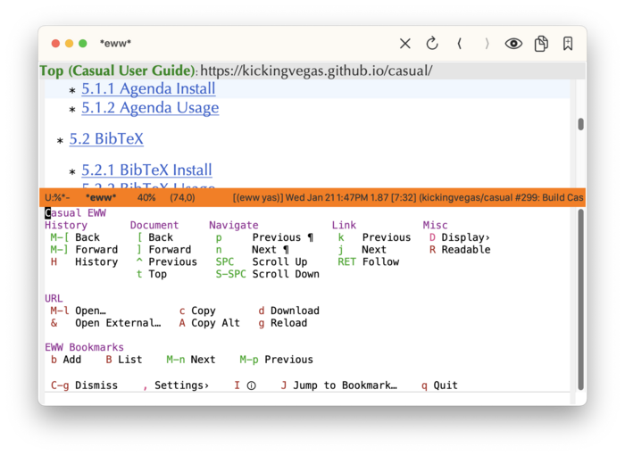
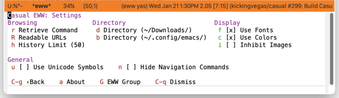
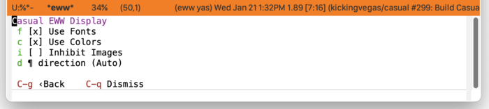
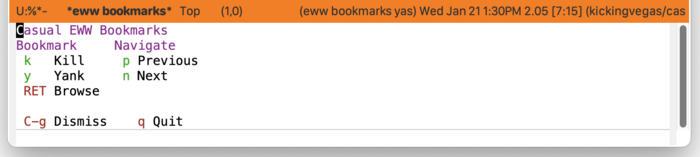
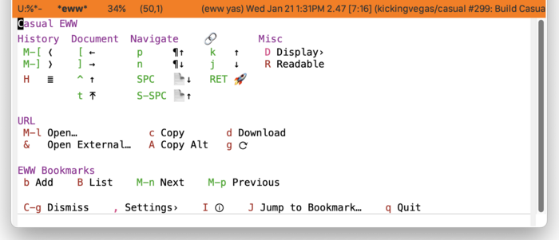

* EWW
#+CINDEX: EWW
#+VINDEX: casual-eww

Casual EWW (library: ~casual-eww~) is a user interface for Emacs Web Wowser ([[info:eww#Top]]), a web browser that runs inside Emacs.

** EWW Install
:PROPERTIES:
:CUSTOM_ID: eww-install
:END:

#+CINDEX: EWW Install

The primary interface for Casual EWW is the Transient menu ~casual-eww-tmenu~. It is autoloaded ([[info:elisp#Autoload]]) so if Casual is installed via ~package-install~ ([[info:emacs#Package Installation]]) then ~casual-eww-tmenu~ can be invoked via ~execute-extended-command~ ({{{kbd(M-x)}}}) without need for modifying your Emacs initialization file.

That said, Casual is designed with the intent of using a common (key)binding across multiple modes to lower cognitive load. This document uses the binding {{{kbd(C-o)}}} for this purpose, but can be changed to user preference.

There are many ways to configure this binding. Shown below is a straightforward implementation:

#+begin_src elisp :lexical no
  (require 'casual-eww) ; load all dependencies including `eww'
  (keymap-set eww-mode-map "C-o" #'casual-eww-tmenu)
#+end_src

If lazy loading of the ~eww~ package is desired then try using ~eval-after-load~:

#+begin_src elisp :lexical no
  (eval-after-load 'eww
    (keymap-set eww-mode-map "C-o" #'casual-eww-tmenu))
#+end_src

#+TEXINFO: @subsubheading Additional Bindings

Do so similarly to access ~casual-eww-bookmarks-tmenu~ in the EWW bookmarks list.

#+begin_src elisp :lexical no
  (keymap-set eww-bookmark-mode-map "C-o" #'casual-eww-bookmarks-tmenu)
#+end_src

While not mandatory, the following bindings can make the EWW keymaps consistent with those used by Casual.

#+BEGIN_SRC elisp :lexical no
  (keymap-set eww-mode-map "C-o" #'casual-eww-tmenu)
  (keymap-set eww-mode-map "C-c C-o" #'eww-browse-with-external-browser)
  (keymap-set eww-mode-map "j" #'shr-next-link)
  (keymap-set eww-mode-map "k" #'shr-previous-link)
  (keymap-set eww-mode-map "[" #'eww-previous-url)
  (keymap-set eww-mode-map "]" #'eww-next-url)
  (keymap-set eww-mode-map "M-]" #'eww-forward-url)
  (keymap-set eww-mode-map "M-[" #'eww-back-url)
  (keymap-set eww-mode-map "n" #'casual-lib-browse-forward-paragraph)
  (keymap-set eww-mode-map "p" #'casual-lib-browse-backward-paragraph)
  (keymap-set eww-mode-map "P" #'casual-eww-backward-paragraph-link)
  (keymap-set eww-mode-map "N" #'casual-eww-forward-paragraph-link)
  (keymap-set eww-mode-map "M-l" #'eww)

  (keymap-set eww-bookmark-mode-map "C-o" #'casual-eww-bookmarks-tmenu)
  (keymap-set eww-bookmark-mode-map "p" #'previous-line)
  (keymap-set eww-bookmark-mode-map "n" #'next-line)
  (keymap-set eww-bookmark-mode-map "<double-mouse-1>" #'eww-bookmark-browse)
#+END_SRC

** EWW Usage
#+CINDEX: EWW Usage
#+VINDEX: casual-eww-tmenu

In an EWW window, invoke ~casual-eww-tmenu~ as shown below.

The following sections are offered in the menu:

- History :: Commands for historical navigation.
  
- Document :: Commands for document navigation (~<link rel="">~) provided the HTML pages support it.
  HTML generated from Texinfo ([[info:texinfo#Top]]) supports these commands.
  
- Navigate :: Commands to navigate within a page.
  
- Link :: Commands to navigate links within a page.
  
- Misc :: Miscellaneous commands.
  
- URL :: Commands associated with the current web page.
  
- EWW Bookmarks :: Commands associated with EWW bookmarks.

#+TEXINFO: @subsubheading EWW Settings
#+VINDEX: casual-eww-settings-tmenu

Customize common EWW settings from this menu. These settings can be persisted to be used across restarts of Emacs.

#+TEXINFO: @subsubheading EWW Display
#+VINDEX: casual-eww-display-tmenu

The menu ~casual-eww-display-tmenu~ provides commands to toggle different display attributes of a web page.

#+TEXINFO: @subsubheading EWW Bookmarks
#+VINDEX: casual-eww-bookmarks-tmenu

The menu ~casual-eww-bookmarks-tmenu~ provides commands for managing the EWW bookmark list.

Note that the EWW bookmarks list has a very limited feature set.

#+TEXINFO: @subsubheading EWW Unicode Symbol Support

By enabling “{{{kbd(u)}}} Use Unicode Symbols” from the Settings menu, Casual EWW will use Unicode symbols as appropriate in its menus.

For more info on using Unicode symbols, please refer to [[#ux-conventions][UX Conventions]].
