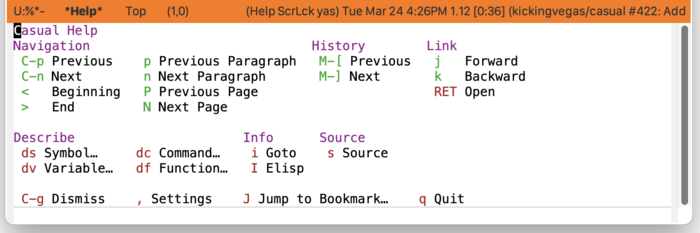

* Help
#+CINDEX: Help
#+VINDEX: casual-help

Casual Help (library: ~casual-help~) is a user interface for ~help-mode~, a major mode for viewing help text and navigating references in it.

** Help Install
:PROPERTIES:
:CUSTOM_ID: help-install
:END:

#+CINDEX: Help Install
#+TEXINFO: @subsubheading Simplified Install
#+VINDEX: casual-help-init

If Casual is installed using ~package-install~, then you can use ~casual-init~ to setup support for Help.

By default, ~casual-init~ will setup support for Help via the hook function ~casual-help-init~ which is included in the customizable variable ~casual-init-hook~.

Use the command ~customize-variable~ on ~casual-init-hook~ to control inclusion of ~casual-help-init~ via a checkbox interface.

Refer to the Simplified Install ([[#install][Install]]) section for more detail on customizing ~casual-init~.

Casual makes opinionated decisions on the keybindings used in its menus. Such opinions are extended from said menus to the keymap(s) of a particular mode. For Help, this can be controlled via the customizable variable ~casual-help-add-extra-keybindings~ (default ~t~).

#+TEXINFO: @subsubheading Hook Install

Users who want a more granular install of Casual modules can invoke the hook function of interest in their Emacs initialization file.

#+begin_src elisp :lexical no
  (casual-help-init)
#+end_src

#+TEXINFO: @subsubheading Manual Install

For users who have manually installed Casual outside of ~package-install~, the following guidance is offered.

The primary interface for Casual Help is the Transient menu ~casual-help-tmenu~. It is autoloaded ([[info:elisp#Autoload]]) so if Casual is installed via ~package-install~ ([[info:emacs#Package Installation]]) then ~casual-help-tmenu~ can be invoked via ~execute-extended-command~ ({{{kbd(M-x)}}}) without need for modifying your Emacs initialization file.

That said, Casual is designed with the intent of using a common (key)binding across multiple modes to lower cognitive load. This document uses the binding {{{kbd(C-o)}}} for this purpose, but can be changed to user preference.

There are many ways to configure this binding. Shown below is a straightforward implementation:

#+begin_src elisp :lexical no
  (require 'casual-help) ; load all dependencies including `help'
  (keymap-set help-mode-map "C-o" #'casual-help-tmenu)
#+end_src

If lazy loading of the ~help~ package is desired then try using ~eval-after-load~:

#+begin_src elisp :lexical no
  (eval-after-load 'help
    (keymap-set help-mode-map "C-o" #'casual-help-tmenu))
#+end_src

#+TEXINFO: @subsubheading Additional Bindings

~casual-help-tmenu~ deviates from the default bindings of ~help-mode-map~ as shown in the table below.

| Default Binding | Casual Binding | Command                               | Notes                                      |
|-----------------+----------------+---------------------------------------+--------------------------------------------|
| l               | M-[            | help-go-back                          | Make consistent with Casual Info behavior. |
| r               | M-]            | help-go-forward                       | Make consistent with Casual Info behavior. |
| n               | N              | help-goto-next-page                   | Use to navigate to next page.              |
| p               | P              | help-goto-previous-page               | Use to navigate to previous page.          |
|                 | n              | casual-lib-browser-forward-paragraph  | Use to navigate paragraph forward.         |
|                 | p              | casual-lib-browser-backward-paragraph | Use to navigate paragraph backward.        |

The following keybindings are recommended to support consistent behavior between ~help-mode~ and ~casual-help-tmenu~.

#+begin_src elisp :lexical no
  (keymap-set help-mode-map "M-[" #'help-go-back)
  (keymap-set help-mode-map "M-]" #'help-go-forward)
  (keymap-set help-mode-map "p" #'casual-lib-browse-backward-paragraph)
  (keymap-set help-mode-map "n" #'casual-lib-browse-forward-paragraph)
  (keymap-set help-mode-map "P" #'help-goto-previous-page)
  (keymap-set help-mode-map "N" #'help-goto-next-page)
  (keymap-set help-mode-map "j" #'forward-button)
  (keymap-set help-mode-map "k" #'backward-button)
#+end_src

** Help Usage
#+CINDEX: Help Usage
#+VINDEX: casual-help-tmenu

After invoking help via a ~describe-~ command, invoke ~casual-help-tmenu~ using the binding ~C-o~ (or your binding of preference).

The following sections are offered in the menu:

- Navigation :: Navigation commands with the document.
- History :: Navigate history of help invocations.
- Link :: Navigate to different references in the help buffer.
- Describe :: Get help for different Elisp types.
- Info :: If available, then open this help topic in [[file:info.org][Info]].
- Source :: Show the Elisp source. If the help displayed is for a customizable variable, then show a customize menu item.

#+TEXINFO: @subsubheading Help Mode Settings
#+VINDEX: casual-help-settings-tmenu

The menu ~casual-help-settings-tmenu~ provides access to different ~help-mode~ settings.

# TODO: Insert screenshot
  
#+TEXINFO: @subsubheading Help Mode Unicode Symbol Support

By enabling “{{{kbd(u)}}} Use Unicode Symbols” from the Settings menu, Casual Help will use Unicode symbols as appropriate in its menus.

For more info on using Unicode symbols, please refer to [[#ux-conventions][UX Conventions]].
