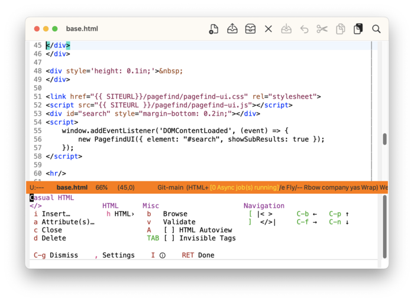
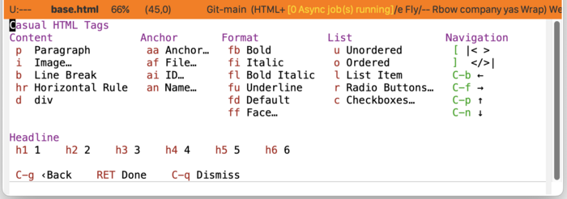
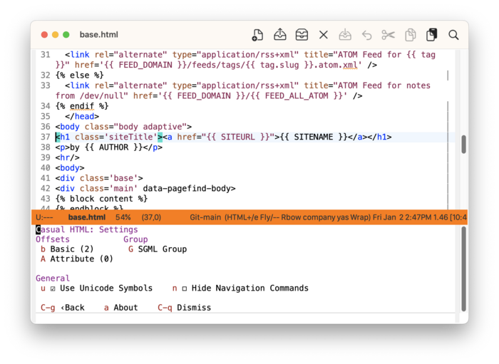
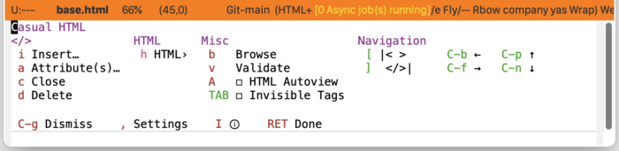

* HTML
:PROPERTIES:
:CUSTOM_ID: html-top
:END:
#+CINDEX: HTML
#+VINDEX: casual-html

Casual HTML (library: ~casual-html~) is a user interface for ~html-mode~ ([[info:emacs#HTML Mode][html-mode]]). 

Casual also has support for CSS editing ([[#css-top][CSS]]).

** HTML Install
:PROPERTIES:
:CUSTOM_ID: html-install
:END:

#+CINDEX: HTML Install
#+TEXINFO: @subsubheading Simplified Install
#+VINDEX: casual-html-init

If Casual is installed using ~package-install~, then you can use ~casual-init~ to setup support for HTML.

By default, ~casual-init~ will setup support for HTML via the hook function ~casual-html-init~ which is included in the customizable variable ~casual-init-hook~.

Use the command ~customize-variable~ on ~casual-init-hook~ to control inclusion of ~casual-html-init~ via a checkbox interface.

Refer to the Simplified Install ([[#install][Install]]) section for more detail on customizing ~casual-init~.

Casual makes opinionated decisions on the keybindings used in its menus. Such opinions are extended from said menus to the keymap(s) of a particular mode. For HTML, this can be controlled via the customizable variable ~casual-html-add-extra-keybindings~ (default ~t~).

#+TEXINFO: @subsubheading Hook Install

Users who want a more granular install of Casual modules can invoke the hook function of interest in their Emacs initialization file.

#+begin_src elisp :lexical no
  (casual-html-init)
#+end_src

#+TEXINFO: @subsubheading Manual Install

For users who have manually installed Casual outside of ~package-install~, the following guidance is offered.

The primary interface for Casual HTML is the Transient menu ~casual-html-tmenu~. It is autoloaded ([[info:elisp#Autoload]]) so if Casual is installed via ~package-install~ ([[info:emacs#Package Installation]]) then ~casual-html-tmenu~ can be invoked via ~execute-extended-command~ ({{{kbd(M-x)}}}) without need for modifying your Emacs initialization file.

That said, Casual is designed with the intent of using a common (key)binding across multiple modes to lower cognitive load. This document uses the binding {{{kbd(M-m)}}} for this purpose, but can be changed to user preference.

There are many ways to configure this binding. Shown below is a straightforward implementation:

#+begin_src elisp :lexical no
  (require 'casual-html) ; load all dependencies including `mhtml-mode'
  (keymap-set html-mode-map "M-m" #'casual-html-tmenu)
#+end_src

If lazy loading of the ~html~ package is desired then try using ~eval-after-load~:

#+begin_src elisp :lexical no
  (eval-after-load 'mhtml-mode
    (keymap-set html-mode-map "M-m" #'casual-html-tmenu))
#+end_src

If HTML Tree-sitter support is enabled, use the keymap ~html-ts-mode-map~ in place of ~html-mode-map~.

#+TEXINFO: @subsubheading Additional Bindings

It is convenient to also bind ~casual-html-tags-tmenu~ as well.

#+begin_src elisp :lexical no
  (keymap-set html-mode-map "C-c m" #'casual-html-tags-tmenu)
#+end_src

** HTML Usage
#+CINDEX: HTML Usage
#+VINDEX: casual-html-tmenu

The following sections are offered in the menu:

- </> :: SGML tag-related commands.
- HTML :: HTML tag-related commands.
- Misc :: Miscellaneous commands.
- Navigation :: Navigation commands.

Note that the item “{{{kbd(d)}}} Delete” (bound to ~sgml-delete-tag~) is not available when HTML Tree-sitter support is enabled.

#+TEXINFO: @subsubheading HTML Tags
#+VINDEX: casual-html-tags-tmenu

This menu provides support for HTML tag-related commands provided by ~html-mode~.

#+TEXINFO: @subsubheading HTML Settings
#+VINDEX: casual-html-settings-tmenu

SGML/HTML mode related settings can be customized using the menu ~casual-html-settings-tmenu~.

#+TEXINFO: @subsubheading HTML Unicode Symbol Support

By enabling “{{{kbd(u)}}} Use Unicode Symbols” from the Settings menu, Casual html will use Unicode symbols as appropriate in its menus.

For more info on using Unicode symbols, please refer to [[#ux-conventions][UX Conventions]].

