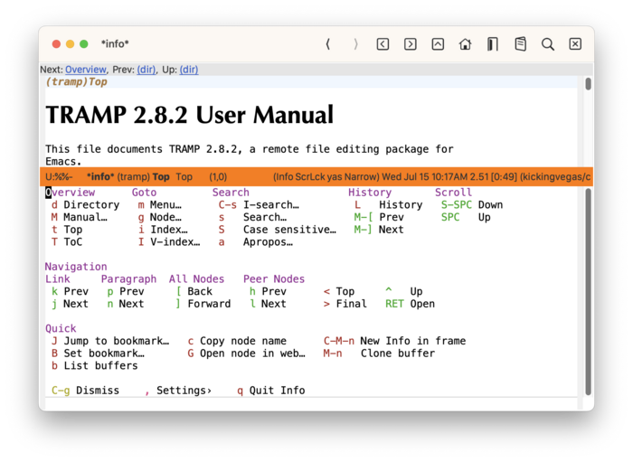
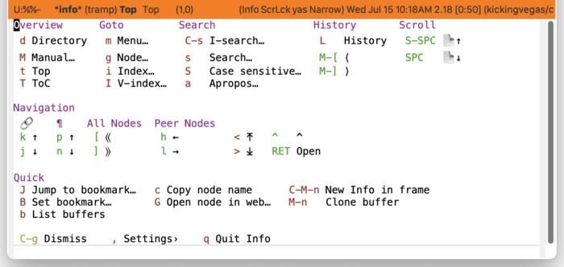

* Info
#+CINDEX: Info
#+VINDEX: casual-info

Casual Info (library: ~casual-info~) is a user interface for the Emacs Info Reader.

** Info Install
:PROPERTIES:
:CUSTOM_ID: info-install
:END:
#+CINDEX: Info Install
#+TEXINFO: @subsubheading Simplified Install
#+VINDEX: casual-info-init

If Casual is installed using ~package-install~, then you can use ~casual-init~ to setup support for Info.

By default, ~casual-init~ will setup support for Info via the hook function ~casual-info-init~ which is included in the customizable variable ~casual-init-hook~.

Use the command ~customize-variable~ on ~casual-init-hook~ to control inclusion of ~casual-info-init~ via a checkbox interface.

Refer to the Simplified Install ([[#install][Install]]) section for more detail on customizing ~casual-init~.

Casual makes opinionated decisions on the keybindings used in its menus. Such opinions are extended from said menus to the keymap(s) of a particular mode. For Info, this can be controlled via the customizable variable ~casual-info-add-extra-keybindings~ (default ~t~).

#+TEXINFO: @subsubheading Hook Install

Users who want a more granular install of Casual modules can invoke the hook function of interest in their Emacs initialization file.

#+begin_src elisp :lexical no
  (casual-info-init)
#+end_src

#+TEXINFO: @subsubheading Manual Install

For users who have manually installed Casual outside of ~package-install~, the following guidance is offered.

The primary interface for Casual Info is the Transient menu ~casual-info-tmenu~. It is autoloaded ([[info:elisp#Autoload]]) so if Casual is installed via ~package-install~ ([[info:emacs#Package Installation]]) then ~casual-info-tmenu~ can be invoked via ~execute-extended-command~ ({{{kbd(M-x)}}}) without need for modifying your Emacs initialization file.

That said, Casual is designed with the intent of using a common (key)binding across multiple modes to lower cognitive load. This document uses the binding {{{kbd(C-o)}}} for this purpose, but can be changed to user preference.

There are many ways to configure this binding. Shown below is a straightforward implementation:

#+begin_src elisp :lexical no
  (require 'casual-info) ; load all dependencies including `info'
  (keymap-set Info-mode-map "C-o" #'casual-info-tmenu)
#+end_src

If lazy loading of the ~info~ package is desired then try using ~eval-after-load~:

#+begin_src elisp :lexical no
  (eval-after-load 'info
    (keymap-set Info-mode-map "C-o" #'casual-info-tmenu))
#+end_src

#+TEXINFO: @subsubheading Additional Bindings

While not required, adding this configuration to your Emacs initialization file will synchronize keybindings between Casual Info and the Info reader. A nice visual improvement is to use ~hl-line-mode~ to highlight the line where the cursor is at. Enabling ~scroll-lock-mode~ will enable scrolling the buffer for content that is larger than its window size with the navigation keys.

#+begin_src elisp :lexical no
  ;; # Info
  ;; Use web-browser history navigation bindings
  (keymap-set Info-mode-map "M-[" #'Info-history-back)
  (keymap-set Info-mode-map "M-]" #'Info-history-forward)
  ;; Bind p and n to paragraph navigation
  (keymap-set Info-mode-map "p" #'casual-info-browse-backward-paragraph)
  (keymap-set Info-mode-map "n" #'casual-info-browse-forward-paragraph)
  ;; Bind h and l to navigate to previous and next nodes
  ;; Bind j and k to navigate to next and previous references
  (keymap-set Info-mode-map "h" #'Info-prev)
  (keymap-set Info-mode-map "j" #'Info-next-reference)
  (keymap-set Info-mode-map "k" #'Info-prev-reference)
  (keymap-set Info-mode-map "l" #'Info-next)
  ;; Bind / to search
  (keymap-set Info-mode-map "/" #'Info-search)
  ;; Set Bookmark
  (keymap-set Info-mode-map "B" #'bookmark-set)

  (add-hook 'Info-mode-hook #'hl-line-mode)
  (add-hook 'Info-mode-hook #'scroll-lock-mode)
#+end_src

** Info Usage
#+CINDEX: Info Usage
#+VINDEX: casual-info-tmenu

Invoke ~M-x info~ to launch the Info reader. Move the point inside the Info window and invoke {{{kbd(C-o)}}} (or a binding of your choosing) to launch the Casual Info menu.

The main menu for Casual Info is organized into the following sections:

- Overview :: Commands that navigate you to a starting point in the info documentation.

- Goto :: Commands that have you specify where to goto in the structure of an Info document.

- Search :: Commands for searching Info.

- History :: Commands related to the history of pages (nodes) navigated to in Info. Note that these commands should not be confused with structural navigation.

- Scroll :: Commands to scroll down or up the current Info page.

- Navigation :: Command related to structurally navigating an Info document. Note that these commands should not be confused with historical navigation.

- Quick :: Miscellaneous commands for working with an Info document. Included are commands for bookmarks, copying the current node name, and cloning the buffer.

#+TEXINFO: @subsubheading Info Unicode Symbol Support

By enabling “{{{kbd(u)}}} Use Unicode Symbols” from the Settings menu, Casual Info will use Unicode symbols as appropriate in its menus.

For more info on using Unicode symbols, please refer to [[#ux-conventions][UX Conventions]].
