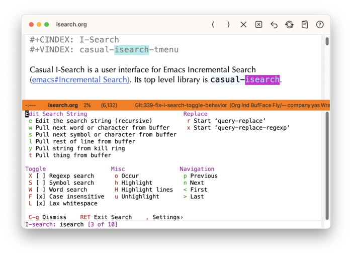
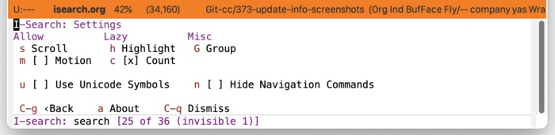
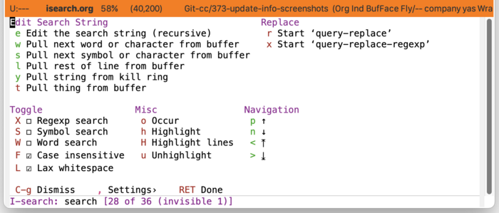

* I-Search
:PROPERTIES:
:CUSTOM_ID: isearch
:END:
#+CINDEX: isearch
#+CINDEX: I-Search
#+VINDEX: casual-isearch

Casual I-Search (library: ~casual-isearch~) is a user interface for Emacs Incremental Search ([[info:emacs#Incremental Search][emacs#Incremental Search)]].

** I-Search Install
:PROPERTIES:
:CUSTOM_ID: i-search-install
:END:
#+CINDEX: I-Search Install
#+TEXINFO: @subsubheading Simplified Install
#+VINDEX: casual-isearch-init

If Casual is installed using ~package-install~, then you can use ~casual-init~ to setup support for I-Search.

By default, ~casual-init~ will setup support for I-Search via the hook function ~casual-isearch-init~ which is included in the customizable variable ~casual-init-hook~.

Use the command ~customize-variable~ on ~casual-init-hook~ to control inclusion of ~casual-isearch-init~ via a checkbox interface.

Refer to the Simplified Install ([[#install][Install]]) section for more detail on customizing ~casual-init~.

Casual makes opinionated decisions on the keybindings used in its menus. Such opinions are extended from said menus to the keymap(s) of a particular mode. For I-Search, this can be controlled via the customizable variable ~casual-isearch-add-extra-keybindings~ (default ~t~).

#+TEXINFO: @subsubheading Hook Install

Users who want a more granular install of Casual modules can invoke the hook function of interest in their Emacs initialization file.

#+begin_src elisp :lexical no
  (casual-isearch-init)
#+end_src

#+TEXINFO: @subsubheading Manual Install

For users who have manually installed Casual outside of ~package-install~, the following guidance is offered.

The primary interface for Casual I-Search is the Transient menu ~casual-isearch-tmenu~. It is autoloaded ([[info:elisp#Autoload]]) so if Casual is installed via ~package-install~ ([[info:emacs#Package Installation]]) then ~casual-isearch-tmenu~ can be invoked via ~execute-extended-command~ ({{{kbd(M-x)}}}) without need for modifying your Emacs initialization file.

That said, Casual is designed with the intent of using a common (key)binding across multiple modes to lower cognitive load. This document uses the binding {{{kbd(C-o)}}} for this purpose, but can be changed to user preference.

There are many ways to configure this binding. Shown below is a straightforward implementation:

#+begin_src elisp :lexical no
  (require 'casual-isearch) ; load all dependencies including `isearch'
  (keymap-set isearch-mode-map "C-o" #'casual-isearch-tmenu)
#+end_src

If lazy loading of the ~isearch~ package is desired then try using ~eval-after-load~:

#+begin_src elisp :lexical no
  (eval-after-load 'isearch
    (keymap-set isearch-mode-map "C-o" #'casual-isearch-tmenu))
#+end_src

** I-Search Usage
#+CINDEX: I-Search Usage
#+VINDEX: casual-isearch-tmenu

The main menu for Casual I-Search is organized into the following sections:

- Edit Search String :: Commands to edit the search string. The type/extent of the string (word, symbol, line, thing) can be specified here.

- Replace :: Invoke ~query-replace~ or ~query-replace-regexp~ on matched strings.

- Toggle :: Commands to configure the type of search. Toggling any menu item in this section will dismiss the Transient menu and return you back to the I-Search minibuffer prompt.

- Misc :: Miscellaneous commands. From here the search string can be fed into ~occur~ or be highlighted.

- Navigation :: Navigation commands for matched strings.

When in search mode (typically via the keybinding {{{kbd(C-s)}}} or {{{kbd(C-r)}}}), pressing the keybinding {{{kbd(C-o)}}} (or binding of your preference) will raise the Transient menu ~casual-isearch-tmenu~. Once raised, only the /I-Search/ commands in the *Toggle*, *Replace*, and *Misc* sections will automatically dismiss the menu when selected. All other /I-Search/ commands will /not/ dismiss the menu.

Use {{{kbd(C-g)}}} to dismiss this Transient menu.

#+TEXINFO: @subsubheading I-Search Settings
#+VINDEX: casual-isearch-settings-tmenu

The menu ~casual-isearch-settings-tmenu~ provides access to different I-Search settings.

#+TEXINFO: @subsubheading I-Search Unicode Symbol Support

By enabling “{{{kbd(u)}}} Use Unicode Symbols” from the Settings menu, Casual I-Search will use Unicode symbols as appropriate in its menus.

For more info on using Unicode symbols, please refer to [[#ux-conventions][UX Conventions]].

