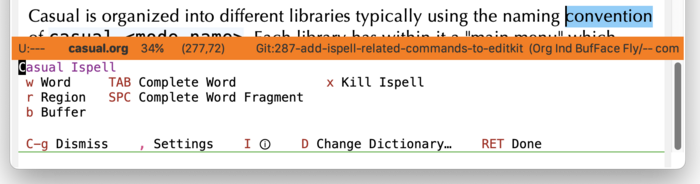
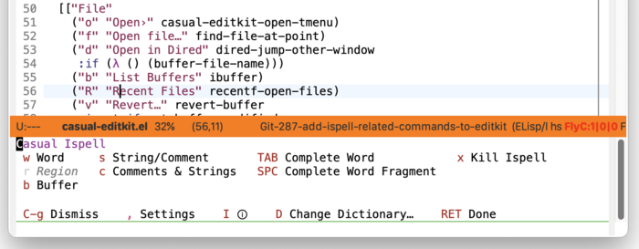

* Ispell
:PROPERTIES:
:CUSTOM_ID: ispell
:END:
#+CINDEX: Ispell

Casual Ispell is a user interface for the Emacs spell checker Ispell ([[info:emacs#Spelling][emacs#Spelling]]).

** Ispell Install
:PROPERTIES:
:CUSTOM_ID: ispell-install
:END:

#+CINDEX: Ispell Install

If you have [[#editkit-install][Casual EditKit installed]] then access to the Transient ~casual-ispell-tmenu~ is available from ~casual-editkit-main-tmenu~.

~casual-ispell-tmenu~ can also be bound to a mode of preference. Shown below is a recommended configuration to use in an initialization file.

#+begin_src elisp :lexical no
  (keymap-set prog-mode-map "C-c s" #'casual-ispell-tmenu)
  (keymap-set text-mode-map "C-c s" #'casual-ispell-tmenu)
  (keymap-set bibtex-mode-map "C-c s" #'casual-ispell-tmenu)
  (keymap-set conf-mode-map "C-c s" #'casual-ispell-tmenu)
#+end_src

** Ispell Usage
#+CINDEX: Ispell Usage
#+VINDEX: casual-ispell-tmenu

From either the Transient ~casual-editkit-main-tmenu~ or via key binding {{{kbd(C-c s)}}}, invoke the menu ~casual-ispell-tmenu~ to get menu of commands shown below:

If no text (region) is selected, then Ispell will behave with respect to the cursor (point) position.

For certain modes, ~casual-ispell-tmenu~ will add the following two menu items:

- {{{kbd(s)}}} String/Comment
- {{{kbd(c)}}} Comments & Strings

The modes are determined by the customizable variable ~casual-ispell-comment-or-string-predicate~ which references a predicate function. By default this function is ~casual-ispell-comment-or-string-p~ which tests the major mode to be one of the following:

- ~prog-mode~
- ~bibtex-mode~
- ~conf-mode~

