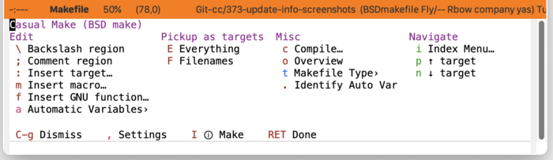
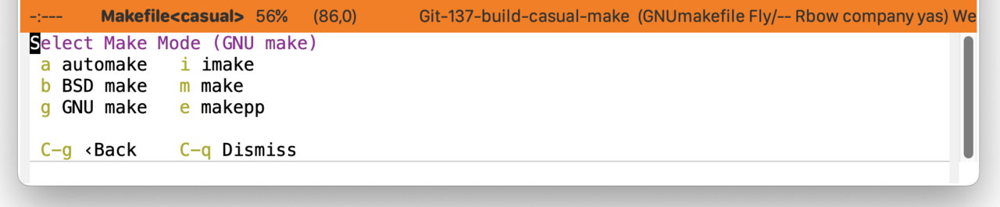
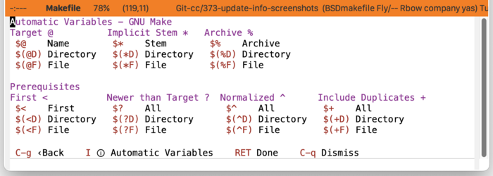

* Make
#+CINDEX: Make
#+VINDEX: casual-make

Casual Make (library: ~casual-make~) is a user interface for ~make-mode~, a mode for editing a Makefile.

** Make Install
:PROPERTIES:
:CUSTOM_ID: make-mode-install
:END:
#+CINDEX: Make Install
#+TEXINFO: @subsubheading Simplified Install
#+VINDEX: casual-make-init

If Casual is installed using ~package-install~, then you can use ~casual-init~ to setup support for Make.

By default, ~casual-init~ will setup support for Make via the hook function ~casual-make-init~ which is included in the customizable variable ~casual-init-hook~.

Use the command ~customize-variable~ on ~casual-init-hook~ to control inclusion of ~casual-make-init~ via a checkbox interface.

Refer to the Simplified Install ([[#install][Install]]) section for more detail on customizing ~casual-init~.

Casual makes opinionated decisions on the keybindings used in its menus. Such opinions are extended from said menus to the keymap(s) of a particular mode. For Make, this can be controlled via the customizable variable ~casual-make-add-extra-keybindings~ (default ~t~).

#+TEXINFO: @subsubheading Hook Install

Users who want a more granular install of Casual modules can invoke the hook function of interest in their Emacs initialization file.

#+begin_src elisp :lexical no
  (casual-make-init)
#+end_src

#+TEXINFO: @subsubheading Manual Install

For users who have manually installed Casual outside of ~package-install~, the following guidance is offered.

The primary interface for Casual Make is the Transient menu ~casual-make-tmenu~. It is autoloaded ([[info:elisp#Autoload]]) so if Casual is installed via ~package-install~ ([[info:emacs#Package Installation]]) then ~casual-make-tmenu~ can be invoked via ~execute-extended-command~ ({{{kbd(M-x)}}}) without need for modifying your Emacs initialization file.

That said, Casual is designed with the intent of using a common (key)binding across multiple modes to lower cognitive load. This document uses the secondary binding {{{kbd(M-m)}}} for this purpose, but can be changed to user preference. Note that ~casual-make-tmenu~ is intended to be used in conjunction with ~casual-editkit-main-tmenu~. ([[#editkit-install][EditKit Install]]).

There are many ways to configure this binding. Shown below is a straightforward implementation:

#+begin_src elisp :lexical no
  (require 'casual-make) ; load all dependencies including `make-mode'
  (keymap-set makefile-mode-map "M-m" #'casual-make-tmenu)
#+end_src

If lazy loading of the ~make-mode~ package is desired then try using ~eval-after-load~:

#+begin_src elisp :lexical no
  (eval-after-load 'make-mode
    (keymap-set makefile-mode-map "M-m" #'casual-make-tmenu))
#+end_src

** Make Usage
#+CINDEX: Make Usage
#+VINDEX: casual-make-tmenu

It is recommended that some basic knowledge of the *make* command is known before using Casual Make.

When in a Makefile buffer, use {{{kbd(M-m)}}} (or your binding of choice) to raise the menu ~casual-make-tmenu~. You will be presented with a menu with the following sections:

- Edit :: Commands for editing the makefile. Note that the backslash and comment commands require a region to be selected.

- Pickup as targets :: Commands for synchronizing ~make-mode~ with the target definitions in the makefile. Use these commands to refresh the known list of targets.

- Misc :: Miscellaneous commands related to working with a makefile.

- Navigate :: Commands to support navigation within the makefile.

Unless you edit makefiles frequently, it is unlikely to recall what an automatic variable declaration means. Casual Make provides the command ~casual-make-identify-autovar-region~ to identify a region-selected automatic variable via the menu item “{{{kbd(.)}}} Identify Auto Var” in ~casual-make-tmenu~. A short description of the automatic variable is shown in the mini-buffer.

*** Makefile Type Selection
#+CINDEX: Makefile Type Selection
#+VINDEX: casual-make-mode-select-tmenu

As there are different variants of *make* and makefile formats, you can configure the mode for different specific makefile types. This can be done by selecting “{{{kbd(t)}}} Makefile Type›” in ~casual-make-tmenu~.

The symbol for this menu is ~casual-make-mode-select-tmenu~.

*** Automatic Variables
#+CINDEX: Automatic Variables
#+VINDEX: casual-make-automatic-variables-tmenu

Casual Make provides a menu to enter GNU Make-style [[info:make#Automatic Variables][automatic variables]].  Note that each keybinding is identical to the automatic variable it represents to both reinforce its declaration and to avoid making another mapping. This menu is available from the menu item “{{{kbd(a)}}} Automatic Variables›”  in ~casual-make-tmenu~.

The symbol for this menu is ~casual-make-automatic-variables-tmenu~.

*** Make Unicode Symbol Support
By enabling “{{{kbd(u)}}} Use Unicode Symbols” from the Settings menu, Casual Make will use Unicode symbols as appropriate in its menus.

For more info on using Unicode symbols, please refer to [[#ux-conventions][UX Conventions]].

