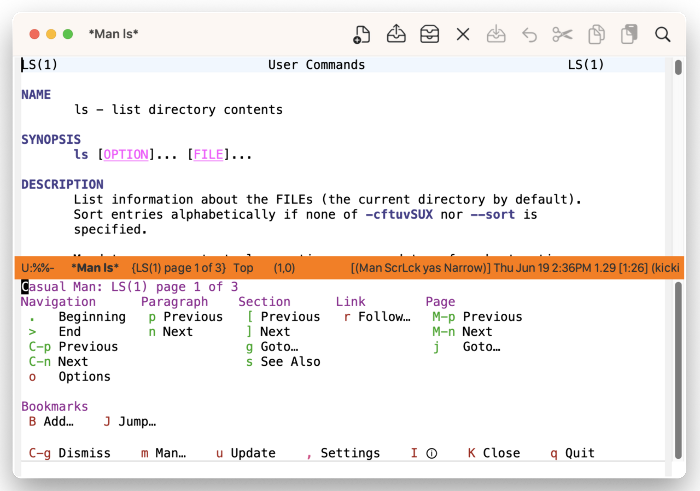
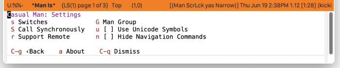

* Man
#+CINDEX: Man
#+VINDEX: casual-man

Casual Man (library: ~casual-man~) is a user interface for ~Man-mode~, a Man page reader.

** Man Install
:PROPERTIES:
:CUSTOM_ID: man-install
:END:

#+CINDEX: Man Install
#+TEXINFO: @subsubheading Simplified Install
#+VINDEX: casual-man-init

If Casual is installed using ~package-install~, then you can use ~casual-init~ to setup support for Man.

By default, ~casual-init~ will setup support for Man via the hook function ~casual-man-init~ which is included in the customizable variable ~casual-init-hook~.

Use the command ~customize-variable~ on ~casual-init-hook~ to control inclusion of ~casual-man-init~ via a checkbox interface.

Refer to the Simplified Install ([[#install][Install]]) section for more detail on customizing ~casual-init~.

Casual makes opinionated decisions on the keybindings used in its menus. Such opinions are extended from said menus to the keymap(s) of a particular mode. For Man, this can be controlled via the customizable variable ~casual-man-add-extra-keybindings~ (default ~t~).

#+TEXINFO: @subsubheading Hook Install

Users who want a more granular install of Casual modules can invoke the hook function of interest in their Emacs initialization file.

#+begin_src elisp :lexical no
  (casual-man-init)
#+end_src

#+TEXINFO: @subsubheading Manual Install

For users who have manually installed Casual outside of ~package-install~, the following guidance is offered.

The primary interface for Casual Man is the Transient menu ~casual-man-tmenu~. It is autoloaded ([[info:elisp#Autoload]]) so if Casual is installed via ~package-install~ ([[info:emacs#Package Installation]]) then ~casual-man-tmenu~ can be invoked via ~execute-extended-command~ ({{{kbd(M-x)}}}) without need for modifying your Emacs initialization file.

That said, Casual is designed with the intent of using a common (key)binding across multiple modes to lower cognitive load. This document uses the binding {{{kbd(C-o)}}} for this purpose, but can be changed to user preference.

There are many ways to configure this binding. Shown below is a straightforward implementation:

#+begin_src elisp :lexical no
  (require 'casual-man) ; load all dependencies including `man'
  (keymap-set Man-mode-map "C-o" #'casual-man-tmenu)
#+end_src

If lazy loading of the ~man~ package is desired then try using ~eval-after-load~:

#+begin_src elisp :lexical no
  (eval-after-load 'man
    (keymap-set Man-mode-map "C-o" #'casual-man-tmenu))
#+end_src

#+TEXINFO: @subsubheading Additional Bindings

~casual-man-tmenu~ deviates from the default bindings of ~Man-mode-map~ as shown in the table below.

| Default Binding | Casual Binding | Command                               | Notes                                                   |
|-----------------+----------------+---------------------------------------+---------------------------------------------------------|
| n               | [              | Man-previous-section                  | Make consistent with Casual Dired and IBuffer behavior. |
| p               | ]              | Man-next-section                      | Make consistent with Casual Dired and IBuffer behavior. |
| k               | K              | Man-kill                              | Reserve k for navigation.                               |
|                 | k              | previous-line                         |                                                         |
|                 | j              | next-line                             |                                                         |
|                 | n              | casual-lib-browser-forward-paragraph  | Use to navigate paragraph forward.                      |
|                 | p              | casual-lib-browser-backward-paragraph | Use to navigate paragraph backward.                     |

The following keybindings are recommended to support consistent behavior between ~Man-mode~ and ~casual-man-tmenu~.

#+begin_src elisp :lexical no
  (keymap-set Man-mode-map "n" #'casual-lib-browse-forward-paragraph)
  (keymap-set Man-mode-map "p" #'casual-lib-browse-backward-paragraph)
  (keymap-set Man-mode-map "[" #'Man-previous-section)
  (keymap-set Man-mode-map "]" #'Man-next-section)
  (keymap-set Man-mode-map "j" #'next-line)
  (keymap-set Man-mode-map "k" #'previous-line)
  (keymap-set Man-mode-map "K" #'Man-kill)
  (keymap-set Man-mode-map "o" #'casual-man-occur-options)
#+end_src

** Man Usage
#+CINDEX: Man Usage
#+VINDEX: casual-man-tmenu

The Man page reader can be invoked via ~M-x man~, where the user is prompted for a search key. This search key is typically the name of a command that has an associated Man page. In the Man page window, pressing {{{kbd(C-o)}}} (or your binding of preference) will raise the menu ~casual-man-tmenu~.

The following sections are offered in the menu:

- Navigation :: Navigation commands with the document.
- Paragraph :: Navigation commands by paragraph.
- Section :: Navigation commands by section.
- Link :: Jump to other Man pages referenced in the current Man page.
- Page :: If the Man page reader is configured to display all manual pages for a given search key, navigation commands for multiple pages is provided.

#+TEXINFO: @subsubheading Options Navigation
#+VINDEX: casual-man-occur-options

~casual-man-tmenu~ provides the menu item {{{kbd(o)}}} which runs the command ~casual-man-occur-options~. This will invoke ~occur~ with a regexp that searches for command line options (for example, "--foo", "-a") that can be navigated via the ~occur~ interface.

#+TEXINFO: @subsubheading Man Settings
#+VINDEX: casual-man-settings-tmenu

By default, the Man page reader will /not/ display all manual pages for given search key. This can be changed in the Settings menu ~casual-man-settings-tmenu~ that can be invoked by pressing {{{kbd(\,)}}} in ~casual-man-tmenu~. 

Press ‘s’ and configure ~Man-switches~ to have the value "-a" to get all manual pages.

  

#+TEXINFO: @subsubheading Man Unicode Symbol Support
By enabling “{{{kbd(u)}}} Use Unicode Symbols” from the Settings menu, Casual Man will use Unicode symbols as appropriate in its menus.

For more info on using Unicode symbols, please refer to [[#ux-conventions][UX Conventions]].
