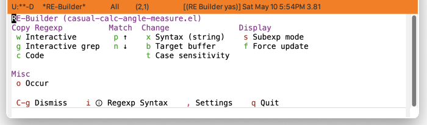

* RE-Builder
#+CINDEX: RE-Builder
#+VINDEX: casual-re-builder

Casual RE-Builder (library: ~casual-re-builder~) is a user interface for RE-Builder.

** RE-Builder Install
:PROPERTIES:
:CUSTOM_ID: re-builder-install
:END:

#+CINDEX: RE-Builder Install

The primary interface for Casual RE-Builder is the Transient menu ~casual-re-builder-tmenu~. It is autoloaded ([[info:elisp#Autoload]]) so if Casual is installed via ~package-install~ ([[info:emacs#Package Installation]]) then ~casual-re-builder-tmenu~ can be invoked via ~execute-extended-command~ ({{{kbd(M-x)}}}) without need for modifying your Emacs initialization file.

That said, Casual is designed with the intent of using a common (key)binding across multiple modes to lower cognitive load. This document uses the binding {{{kbd(C-o)}}} for this purpose, but can be changed to user preference.

There are many ways to configure this binding. Shown below is a straightforward implementation:

#+begin_src elisp :lexical no
  (require 'casual-re-builder) ; load all dependencies including `re-builder'
  (keymap-set reb-mode-map "C-o" #'casual-re-builder-tmenu)
  (keymap-set reb-lisp-mode-map "C-o" #'casual-re-builder-tmenu)
#+end_src

If lazy loading of the ~re-builder~ package is desired then try using ~eval-after-load~:

#+begin_src elisp :lexical no
  (eval-after-load 're-builder
    (progn
      (keymap-set re-builder-mode-map "C-o" #'casual-re-builder-tmenu)
      (keymap-set reb-lisp-mode-map "C-o" #'casual-re-builder-tmenu)))
#+end_src

** RE-Builder Usage
#+CINDEX: RE-Builder Usage
#+VINDEX: casual-re-builder-tmenu

When the command ~re-builder~ is invoked, a buffer named "✳︎RE-Builder✳︎" is created. Activate Casual RE-Builder with the binding {{{kbd(C-o}}} (or one of your preference). 

At the top of the menu shows the title "RE-Builder" with the target buffer enclosed in parenthesis. The regexp pattern will be applied to the target buffer. The target buffer can be changed with the “{{{kbd(b)}}} Target buffer” menu item.

Emacs supports three different regexp syntax: 1) read, 2) string, 3) Rx.  Use the “{{{kbd(x)}}} Syntax” menu item to alter it. The current syntax is shown in parenthesis.

If multiple sub-expressions are in the regexp pattern, then they can be observed via the “{{{kbd(s)}}} Subexp mode” menu item.

If the regexp pattern entered in "✳︎RE-Builder✳︎" finds multiple matches, a match can be navigated to via the  “{{{kbd(p)}}} Previous” and “{{{kbd(n)}}} Next” menu items.

#+TEXINFO: @subsubheading Exporting the Regexp Pattern
Once a desired regexp pattern is defined, there are two menu items that can be used to export (copy) it to the kill-ring for further use.

- “{{{kbd(w)}}} Interactive” will copy the regexp to the kill-ring so that it can be yanked in an interactive command that requires a regexp (e.g. ~query-replace-regexp~).
  - This can only be used when the regexp syntax is set to ~string~.
  - ❗️When yanking (typically {{{kbd(C-y)}}}) a regexp into an interactive prompt, you /must/ have the point/focus in the minibuffer prompt (typically via mouse). Otherwise the desired content can be altered with extra escaping.
- “{{{kbd(c)}}} Code” will copy the regexp to the kill-ring so that it can be yanked into a Elisp code that requires a regexp argument.
- “{{{kbd(g)}}} Interactive grep” will copy the regexp so that it can be used with command that take a GNU grep regex argument.
  - Example commands that do this are ~dired-do-find-regexp~ and ~dired-do-find-regexp-and-replace~.
  - This command presumes that you have GNU grep installed and configured for use by Emacs.
  - ❗️At current this is an experimental feature. The regexp exported from RE-Builder may not work. If so please report an [[https://github.com/kickingvegas/casual-re-builder/issues][issue]] describing the desired regexp and the target text.
  - This can only be used when the regexp syntax is set to ~string~.    

#+TEXINFO: @subsubheading Regexp Syntax Help
The menu item {{{kbd(i)}}} will invoke the Info page for regexp syntax with respect to the current syntax type.

#+TEXINFO: @subsubheading Quitting RE-Builder
Select “{{{kbd(q)}}} Quit” to exit the RE-Builder tool.

#+TEXINFO: @subsubheading RE-Builder Settings
#+VINDEX: casual-re-builder-settings-tmenu

The menu ~casual-re-builder-settings-tmenu~ provides access to different RE-Builder settings.

# TODO: Insert screenshot

#+TEXINFO: @subsubheading RE-Builder Unicode Symbol Support
By enabling “{{{kbd(u)}}} Use Unicode Symbols” from the Settings menu, Casual RE-Builder will use Unicode symbols as appropriate in its menus.

For more info on using Unicode symbols, please refer to [[#ux-conventions][UX Conventions]].
